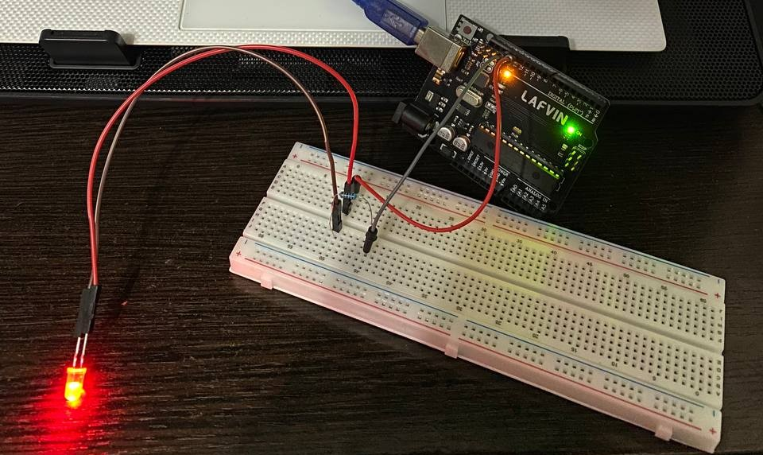

# Lab 1.1 - User Interaction: STDIO Serial Interface

## Objective
Develop an application that controls an LED through text commands transmitted via serial interface using the STDIO library.

---

## Requirements

### Hardware Required
- **Microcontroller**: Arduino Uno
- **LED**: any color
- **Resistor**: 220Ω (red-red-brown-gold)
- **Breadboard**
- **Jumper wires**: 2x male-to-male
- **USB cable**: Type-B (Arduino to PC)

### Software Required
- **IDE**: Visual Studio Code with PlatformIO extension
- **Framework**: Arduino
- **Serial Terminal**: PlatformIO Serial Monitor
- **Baud Rate**: 9600

---

## Physical Setup

### Step-by-Step Wiring

**Step 1: Insert LED into breadboard**
- Long leg (anode, +) → row 10, column e
- Short leg (cathode, -) → row 10, column f

**Step 2: Insert 220Ω resistor**
- One leg → row 10, column g (same row as LED cathode)
- Other leg → row 15, column g

**Step 3: Connect Pin 13 to LED**
- Red jumper wire from Arduino Pin 13 → breadboard row 10, column a

**Step 4: Connect GND**
- Black jumper wire from Arduino GND → breadboard row 15, column h

**Step 5: Connect USB**
- USB Type-B cable from Arduino to computer

### Final Setup

*Assembled circuit showing Arduino Uno, LED, resistor, and wiring connections*

### Circuit Diagram
```
Arduino Pin 13 → LED (+) → LED (-) → 220Ω Resistor → GND
```

---

## Project Architecture

### Folder Structure
```
ES-Labs/
├── lib/                    # reusable modules
│   ├── Led/               # LED driver
│   │   ├── Led.h
│   │   └── Led.cpp
│   └── Serial/            # Serial communication module
│       ├── Serial.h
│       └── Serial.cpp
├── src/
│   └── main.cpp           # main application
├── docs/
│   └── Lab1.1.md          # documentation
└── platformio.ini         # project config
```

### Clean Architecture Principles

**1. Separation of Concerns**
- Each peripheral (LED, Serial) has its own module
- Main application only handles command logic
- No hardware details in main.cpp

**2. Encapsulation**
- Led class encapsulates pin control
- Serial module hides STDIO setup complexity

**3. Reusability**
- Led and Serial modules can be used in future labs
- Just copy the folder to another project

**4. Naming Convention**
- CamelCase for all variables, functions, and classes
- Examples: `serialInit`, `turnOn`, `baudRate`

---

## Code Explanation

### Main Application (main.cpp)
```cpp
#define LED_PIN 13
#define CMD_BUFFER_SIZE 20

Led led(LED_PIN);  // create LED object

void setup() {
  serialInit(9600);  // init serial with STDIO support
}

void loop() {
  char command[CMD_BUFFER_SIZE];
  
  if (serialReadCommand(command, sizeof(command))) {
    // parse and execute commands
    if (strcmp(command, "led on") == 0) {
      led.turnOn();
      serialPrint("LED is now ON");
    }
    // ...
  }
}
```

### Led Module
**Led.h** - defines the LED interface
- `turnOn()` - sets LED HIGH
- `turnOff()` - sets LED LOW
- `toggle()` - switches state
- `getState()` - returns current state

**Led.cpp** - implements hardware control using digitalWrite

### Serial Module
**Serial.h** - defines serial communication interface
- `serialInit()` - configures serial and redirects `printf` to Serial
- `serialReadCommand()` - reads line from serial, echoes back
- `serialPrint()` - prints using `printf` (STDIO library)

**Serial.cpp** - key implementation detail:
```cpp
fdev_setup_stream(&serialStdout, serialPutc, NULL, _FDEV_SETUP_WRITE);
stdout = &serialStdout;
```
This redirects standard C library `printf` to Arduino Serial output.

---

## How to Build and Run

### 1. Upload Code to Arduino
Press the **Upload button** (→) in PlatformIO toolbar, or run:
```powershell
platformio run --target upload
```

Wait for "SUCCESS" message.

### 2. Open Serial Monitor
Click the **plug icon** (🔌) in the bottom toolbar, or run:
```powershell
platformio device monitor
```

### 3. Test Commands

Expected output:
```
System Ready!
Send 'led on' or 'led off'
```

**Test:**
- Type: `led on` → LED lights up
- Type: `led off` → LED turns off
- Type: `test` → Shows error message

Exit serial monitor with `Ctrl+C`

---

## Commands Reference

| Command | Action | Response |
|---------|--------|----------|
| `led on` | Turn LED ON | "LED is now ON" |
| `led off` | Turn LED OFF | "LED is now OFF" |
| Any other | Invalid | "Invalid command! Use 'led on' or 'led off'" |

---

## Technical Details

**Memory Usage:**
- RAM: ~16% (342 bytes)
- Flash: ~12% (3878 bytes)

**Key Features:**
- Uses STDIO library (`printf`, `stdout`)
- Command echo for user feedback
- Handles both `\n` and `\r\n` line endings
- Modular design for future expansion

---

## Future Extensions

This lab provides foundation for:
- Lab 1.2: Adding button input
- Lab 1.3: LCD display integration
- Lab 1.4: Keypad interface
- More complex command parsing
