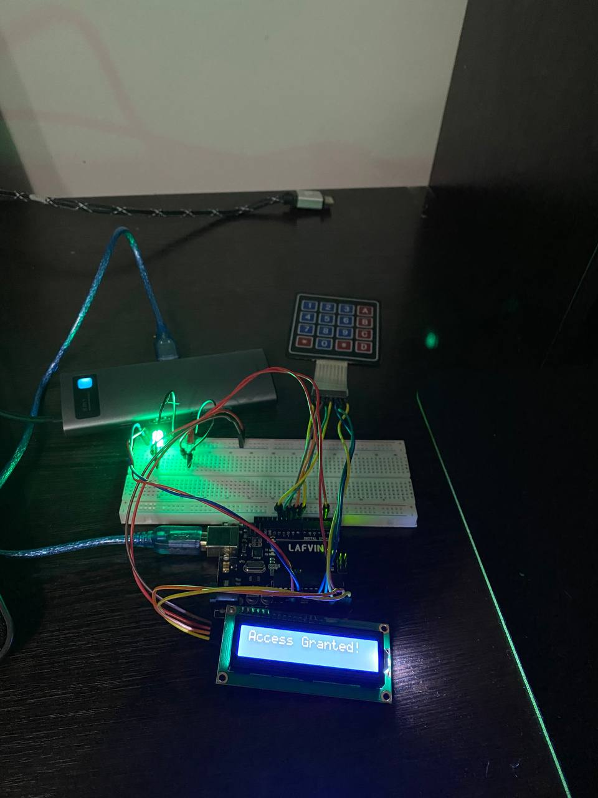

# Lab 1.2 - User Interaction: STDIO - LCD + Keypad

## Objective
Develop an application that reads a code from a 4x4 keypad, validates it, and displays the result on an LCD using the STDIO library. A green LED lights up for a valid code, red for invalid.

---

## Requirements

### Hardware Required
- **Microcontroller**: Arduino Uno
- **LCD 2x16** with I2C backpack module
- **Keypad 4x4**
- **Green LED**
- **Red LED**
- **2x Resistors**: 220Ω (red-red-brown-gold)
- **Breadboard**
- **Jumper wires**: male-to-male
- **USB cable**: Type-B (Arduino to PC)

### Software Required
- **IDE**: Visual Studio Code with PlatformIO extension
- **Framework**: Arduino
- **Libraries**: `LiquidCrystal_I2C`, `Keypad` (auto-installed via platformio.ini)

---

## Pin Connections

### LCD (I2C Backpack)
| LCD Pin | Arduino Pin | Notes |
|---------|-------------|-------|
| VCC | 5V | Power |
| GND | GND | Ground |
| SDA | A4 | I2C data |
| SCL | A5 | I2C clock |

> **Note:** If the LCD stays blank, try changing `LCD_ADDRESS` from `0x27` to `0x3F` in [lib/Lcd/Lcd.h](../lib/Lcd/Lcd.h)

### Keypad 4x4
| Keypad Pin | Arduino Pin |
|------------|-------------|
| Row 1 | 8 |
| Row 2 | 9 |
| Row 3 | 10 |
| Row 4 | 11 |
| Col 1 | 12 |
| Col 2 | A0 |
| Col 3 | A1 |
| Col 4 | A2 |

### LEDs
| Component | Arduino Pin |
|-----------|-------------|
| Green LED | A3 |
| Red LED | 3 |

---

## Physical Setup

### Understanding Your Breadboard
```
[+ rail: ─────────────────────────────────────]  ← full row connected
[- rail: ─────────────────────────────────────]  ← full row connected
      col:  1   2   3   4   5   6  ...  30
row a:       .   .   .   .   .   .
row b:       .   .   .   .   .   .
row c:       .   .   .   .   .   .    } same column = all connected
row d:       .   .   .   .   .   .
row e:       .   .   .   .   .   .
             ══════════ GAP ═══════════
row f:       .   .   .   .   .   .
...
row j:       .   .   .   .   .   .
[- rail: ─────────────────────────────────────]
[+ rail: ─────────────────────────────────────]
```
> `a5`, `b5`, `c5`, `d5`, `e5` are all the same electrical point — they share the same column.

---

### Step 0: Connect Power Rails to Arduino (do this FIRST)
Arduino Uno has only **one 5V pin and one GND pin**. The breadboard power rails act as a bus — connect once, use everywhere:

1. Jumper wire: Arduino **GND** pin → any hole on the **top `−` rail**
2. Jumper wire: Arduino **5V** pin → any hole on the **top `+` rail**

Now every component just connects to the rail instead of the Arduino pin directly:
- Needs **5V**? → connect to any `+` rail hole
- Needs **GND**? → connect to any `−` rail hole

```
Arduino 5V  ──────→  [+ rail: ─────────────────]  ←── LCD VCC, etc.
Arduino GND ──────→  [- rail: ─────────────────]  ←── resistors, LCD GND, etc.
```

---

### Green LED (Arduino pin A3)

The LED legs go in **adjacent columns, same row**. The resistor is placed vertically below the cathode leg down to row e, then a jumper connects row e to the `−` rail.

```
top - rail: ──────────────────────────────────
      col:   1   2   3   4   5
row a:               [+]  [-]          ← insert LED here
row b:               [J]   |           ← jumper from A3 here
row c:                    [=]          ← resistor body
row d:                    [=]
row e:                    [G]──────────→ top - rail
```
Legend: `[+]` anode, `[-]` cathode, `[J]` jumper wire, `[=]` resistor, `[G]` wire to GND rail

Steps:
1. LED long leg (anode) → **col 3, row a**
2. LED short leg (cathode) → **col 4, row a**
3. Resistor leg 1 → **col 4, row b** (same column as cathode = connected)
4. Resistor leg 2 → **col 4, row e** (other end, further down)
5. Jumper: Arduino **A3** → **col 3, row b**
6. Jumper: **col 4, row e** → any hole on **top `−` rail**

Circuit: `A3 → col3 → LED → col4 → resistor → − rail → GND`

---

### Red LED (Arduino pin 3)

Same method, placed a few columns away from the green LED.

```
      col:   8   9   10  11  12
row a:               [+]  [-]          ← insert LED here
row b:               [J]   |           ← jumper from pin 3 here
row c:                    [=]
row d:                    [=]
row e:                    [G]──────────→ top - rail
```

Steps:
1. LED long leg (anode) → **col 10, row a**
2. LED short leg (cathode) → **col 11, row a**
3. Resistor leg 1 → **col 11, row b**
4. Resistor leg 2 → **col 11, row e**
5. Jumper: Arduino **pin 3** → **col 10, row b**
6. Jumper: **col 11, row e** → any hole on **top `−` rail**

Circuit: `Pin3 → col10 → LED → col11 → resistor → − rail → GND`

---

### LCD Wiring
1. LCD **VCC** → any hole on **`+` rail** (not Arduino 5V directly!)
2. LCD **GND** → any hole on **`−` rail**
3. LCD **SDA** → Arduino **A4**
4. LCD **SCL** → Arduino **A5**

### Keypad Wiring
Connect using ribbon cable or individual wires:
1. Keypad pins 1-4 (rows) → Arduino pins 8, 9, 10, 11
2. Keypad pins 5-8 (cols) → Arduino pins 12, A0, A1, A2

### Final Setup

*Assembled circuit with Arduino, LCD, 4x4 keypad, green and red LEDs*

---

## Project Architecture

### Folder Structure
```
ES-Labs/
├── lib/
│   ├── Led/            # reused from Lab 1.1
│   ├── Lcd/            # LCD driver (stdout → LCD via I2C)
│   └── Keypad/         # Keypad driver (stdin → keypad)
├── src/
│   ├── main.cpp        # delegates to active lab
│   ├── Lab1_1/         # Lab 1.1 logic
│   └── Lab1_2/         # Lab 1.2 logic  ← active
└── docs/
    └── Lab1.2.md
```

### STDIO Mapping
| STDIO Stream | Redirected To |
|---|---|
| `stdout` (`printf`) | LCD display |
| `stdin` (`getchar`) | 4x4 Keypad |

### Clean Architecture Principles
- **Lcd module** — wraps `LiquidCrystal_I2C`, redirects `stdout`
- **Keypad module** — wraps `Keypad` library, redirects `stdin`
- **Led module** — reused directly from Lab 1.1, no changes needed
- **main.cpp** — single `#define ACTIVE_LAB 2` to switch between labs

---

## Code Explanation

### Lab1_2.cpp — Application Logic
```
1. lcdInit()     → LCD starts, stdout redirected to LCD
2. keypadInit()  → stdin redirected to keypad
3. loop:
   a. printf("Enter code:") → shows on LCD
   b. getchar() x4          → reads each keypress from keypad
   c. strcmp() validation   → checks against secret code
   d. printf(result)        → shows "Access Granted/Denied" on LCD
   e. LED on for 2 seconds
```

### Lcd Module (lib/Lcd/)
- `lcdInit()` — calls `lcd.init()`, `lcd.backlight()`, redirects `stdout`
- `lcdClear()` — clears screen and resets cursor
- `lcdSetCursor()` — moves cursor for second row
- Internal `lcdPutc()` — handles newline and column wrapping automatically

### Keypad Module (lib/Keypad/)
- `keypadInit()` — redirects `stdin` to keypad stream
- `keypadGetKey()` — calls `getchar()` (STDIO, blocks until keypress)
- Internal `keypadGetc()` — polls `keypad.getKey()` until a key is pressed

---

## How to Build and Run

### 1. Set Active Lab
In [src/main.cpp](../src/main.cpp):
```cpp
#define ACTIVE_LAB 2
```

### 2. Upload Code
```powershell
platformio run --target upload
```

### 3. Test

The LCD should display:
```
Enter code:
****
```

Then after entering 4 keys:
- Correct code (`1234`) → `Access Granted!` + green LED on
- Wrong code → `Access Denied!` + red LED on
- After 2 seconds → LEDs off, returns to prompt

### Default Code
The secret code is defined in [src/Lab1_2/Lab1_2.cpp](../src/Lab1_2/Lab1_2.cpp):
```cpp
static const char secretCode[CODE_LENGTH + 1] = "1234";
```
Change `"1234"` to any 4-character combination.

---

## Keypad Layout Reference
```
[ 1 ][ 2 ][ 3 ][ A ]
[ 4 ][ 5 ][ 6 ][ B ]
[ 7 ][ 8 ][ 9 ][ C ]
[ * ][ 0 ][ # ][ D ]
```

---

## Technical Details
- **I2C Address**: `0x27` (try `0x3F` if LCD is blank)
- **Code Length**: 4 characters (configurable via `CODE_LENGTH`)
- **Result Display Time**: 2 seconds (configurable via `RESULT_DELAY`)
- **STDIO**: `stdout` → LCD, `stdin` → Keypad
