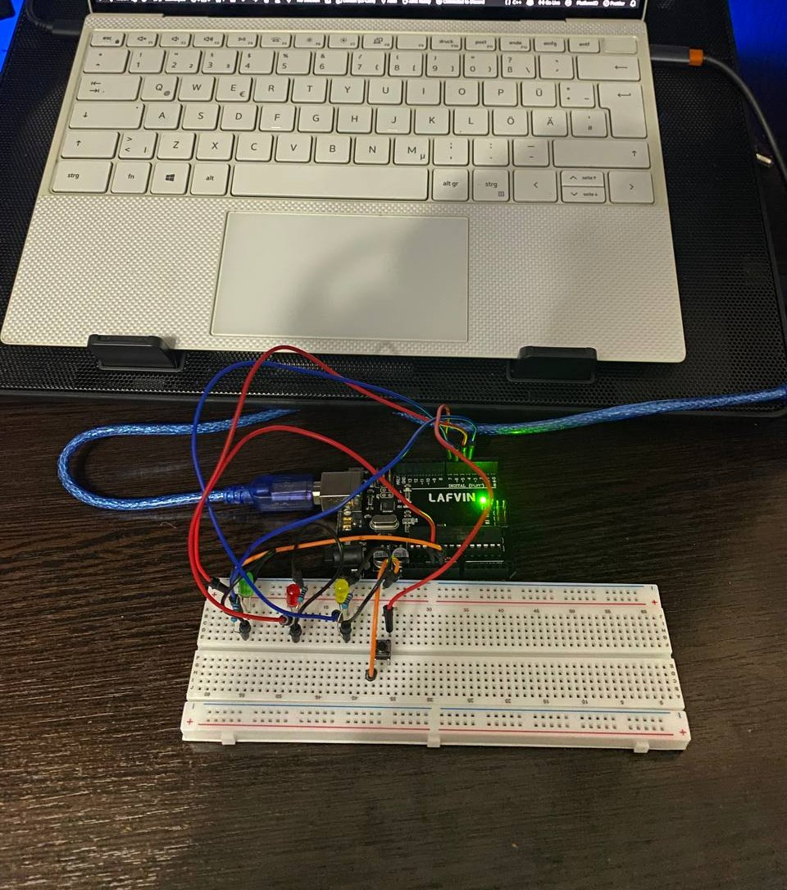

# Lab 2.1 — Sequential Non-Preemptive Task Scheduling

## Objective
Design and implement a modular embedded application that executes three tasks
sequentially using a bare-metal non-preemptive scheduler.  The system measures
button press duration, classifies each press as short or long, provides LED
visual feedback, and periodically reports press statistics through STDIO.

---

## Requirements

### Hardware Required
- **Microcontroller**: Arduino Uno
- **Push button**: 1× momentary tactile (4-pin)
- **Green LED**: short-press feedback
- **Red LED**: long-press feedback
- **Yellow LED**: blink sequence (5× short, 10× long)
- **3× Resistors**: 220 Ω (red-red-brown-gold)
- **Breadboard**
- **Jumper wires**: male-to-male
- **USB cable**: Type-B (Arduino to PC)

### Software Required
- Visual Studio Code + PlatformIO extension
- Framework: Arduino
- Serial Monitor: 9600 baud

---

## Pin Connections

| Component | Arduino Pin | Notes |
|-----------|-------------|-------|
| Green LED | 4 | Short press indicator |
| Red LED | 5 | Long press indicator |
| Yellow LED | 6 | Blink feedback (Task 2) |
| Push button | 7 | Other leg → GND, INPUT_PULLUP enabled |

---

## Physical Setup

### Step 0: Power Rails (do this FIRST)

Connect the Arduino power pins to the breadboard's power rails.  Every
component in this lab taps power and ground from these rails, so do this
before placing anything else.

1. Jumper: Arduino **GND** → any hole on **top `−` rail**
2. Jumper: Arduino **5V** → any hole on **top `+` rail**

```
Arduino 5V  ──────→  [+ rail: ─────────────────────────────────────]
Arduino GND ──────→  [- rail: ─────────────────────────────────────]
```

---

### Green LED (Arduino pin 4)

```
top − rail: ────────────────────────────────────────────────────────
      col:   1   2   3   4   5
row a:               [+]  [-]          ← insert LED here
row b:               [J]   |           ← jumper from pin 4 here
row c:                    [=]          ← resistor
row d:                    [=]
row e:                    [G]──────────→ top − rail
```

Legend: `[+]` anode (long leg), `[-]` cathode (short leg), `[J]` jumper to Arduino, `[=]` resistor, `[G]` wire to GND rail

Steps:
1. LED long leg (anode) → **col 3, row a**
2. LED short leg (cathode) → **col 4, row a**
3. Resistor leg 1 → **col 4, row b** (same column as cathode = connected)
4. Resistor leg 2 → **col 4, row e**
5. Jumper: Arduino **pin 4** → **col 3, row b**
6. Jumper: **col 4, row e** → any hole on **top `−` rail**

Circuit: `Pin 4 → col 3 → LED → col 4 → 220 Ω → GND`

---

### Red LED (Arduino pin 5)

Same wiring pattern, placed a few columns to the right.

```
      col:   8   9   10  11  12
row a:               [+]  [-]
row b:               [J]   |
row c:                    [=]
row d:                    [=]
row e:                    [G]──────────→ top − rail
```

Steps:
1. LED long leg (anode) → **col 10, row a**
2. LED short leg (cathode) → **col 11, row a**
3. Resistor leg 1 → **col 11, row b**
4. Resistor leg 2 → **col 11, row e**
5. Jumper: Arduino **pin 5** → **col 10, row b**
6. Jumper: **col 11, row e** → any hole on **top `−` rail**

Circuit: `Pin 5 → col 10 → LED → col 11 → 220 Ω → GND`

---

### Yellow LED (Arduino pin 6)

Same pattern again, further right.

```
      col:   15  16  17  18  19
row a:               [+]  [-]
row b:               [J]   |
row c:                    [=]
row d:                    [=]
row e:                    [G]──────────→ top − rail
```

Steps:
1. LED long leg (anode) → **col 17, row a**
2. LED short leg (cathode) → **col 18, row a**
3. Resistor leg 1 → **col 18, row b**
4. Resistor leg 2 → **col 18, row e**
5. Jumper: Arduino **pin 6** → **col 17, row b**
6. Jumper: **col 18, row e** → any hole on **top `−` rail**

Circuit: `Pin 6 → col 17 → LED → col 18 → 220 Ω → GND`

---

### Push Button (Arduino pin 7)

Place the button **horizontally** (long axis left-right) so the legs land in
rows e and f, straddling the centre gap.

```
         col 22   col 23   col 24
row d:    [   ]             [   ]   ← wire pin 7 here (e.g. col 22, row d)
row e:    [leg]   body      [leg]   ← top half  (col 22/e ↔ col 24/e, always bridged)
          ════════ GAP ════════
row f:    [leg]   body      [leg]   ← bottom half (col 22/f ↔ col 24/f, always bridged)
row g:    [   ]             [   ]   ← wire GND here (e.g. col 22, row g)
```

Internal bridging:
- col 22/row e ↔ col 24/row e — always connected (same short side of body)
- col 22/row f ↔ col 24/row f — always connected (same short side of body)
- row e half ↔ row f half — only connected **while pressed**

Steps:
1. Push the button down so top legs sit in **row e** (cols 22 and 24) and bottom legs in **row f**
2. Jumper: Arduino **pin 7** → **col 22, row d** (any free hole above the gap in col 22)
3. Jumper: **col 22, row g** (any free hole below the gap in col 22) → **`−` rail**

Circuit: `Pin 7 (INPUT_PULLUP) → col 22/row-e half → [press] → col 22/row-f half → GND`

> **How it works:** `INPUT_PULLUP` holds pin 7 HIGH while the button is open.
> Pressing the button pulls it to GND (LOW).  The driver detects falling and
> rising edges to measure press duration — no `delay()` needed.

---

### Complete Wiring Summary

```
Arduino Uno
┌───────────────────┐
│  5V  ─────────────┼──→  + rail
│  GND ─────────────┼──→  − rail
│                   │
│  pin 4 ───────────┼──→  Green  LED anode  → cathode → 220 Ω → − rail
│  pin 5 ───────────┼──→  Red    LED anode  → cathode → 220 Ω → − rail
│  pin 6 ───────────┼──→  Yellow LED anode  → cathode → 220 Ω → − rail
│  pin 7 ───────────┼──→  Button one side
│                   │     Button other side → − rail
└───────────────────┘
```

LED current per resistor:

$$I_{LED} = \frac{V_{CC} - V_{LED}}{R} = \frac{5\text{ V} - 2\text{ V}}{220\text{ Ω}} \approx 13.6\text{ mA}$$

### Final Setup

*Assembled circuit with Arduino Uno, green/red/yellow LEDs with 220 Ω resistors, and push button*

---

## Software Architecture

### STDIO Mapping

| STDIO Stream | Redirected To |
|---|---|
| `stdout` (`printf`) | Serial / UART |
| `stdin` | Serial / UART (unused in this lab) |

`serialInit(9600)` installs both streams. Task 3 uses `printf()` for all reporting — no direct `Serial.print()` calls in application code.

### Scheduler — Timer2 ISR

Timer2 (CTC mode): Prescaler = 64 → f_timer = 16 MHz / 64 = 250 kHz, OCR2A = 249 → **1 ms tick**.

```
  Arduino reset
       │
  setup()  ─── serialInit · buttonInit · schedulerInit
       │
  loop() ◄─────────────────────────────────────────────┐
       │                                               │
  schedulerDispatch()                                 │
    for each task:                                    │
      if task.ready ──yes──► task.ready = false        │
                             call task.func()          │
      if not ready  ──────── skip                      │
    all tasks done ──────────────────────────────────►─┘

  ╔══════════════════════════════╗
  ║  ISR  (every 1 ms)           ║  ◄── Timer2 CTC, prescaler=64, OCR2A=249
  ║  for each task:              ║
  ║    task.counter--            ║
  ║    if counter == 0:          ║
  ║      task.ready = true       ║
  ║      reload counter          ║
  ╚══════════════════════════════╝
```

### Task Schedule

| Task | Function | Recurrence | Offset | Role |
|------|----------|------------|--------|------|
| T1 | `task1ButtonMonitor` | 50 ms | 0 ms | PROVIDER — samples button, writes signals |
| T2 | `task2StatsAndBlink` | 50 ms | 5 ms | CONSUMER of T1, PROVIDER of statistics |
| T3 | `task3Report` | 10 000 ms | 10 ms | CONSUMER of statistics, prints via `printf` |

Offset guarantees T1 always executes **5 ms before T2** every period, so the
press event is always ready when T2 runs.

```
time(ms):  0    5   10   50   55   60  ...  10000  10010
           │    │    │    │    │    │         │      │
T1 ────────█─────────────█──────────── ... ──────────────
T2 ─────────────█────────────█─────── ... ──────────────
T3 ──────────────────█────────────── ... ───█────────────

█ = task fires
```

### Provider / Consumer Data Flow

```
┌─────────────┐   sig_pressEvent        ┌─────────────┐   sig_statTotal         ┌─────────────┐
│   Task 1    │   sig_pressDuration     │   Task 2    │   sig_statShort         │   Task 3    │
│   Button    │ ──────────────────────► │  Stats +    │ ──────────────────────► │   Report    │
│   Monitor   │   sig_pressIsShort      │   Blink     │   sig_statLong          │  (printf)   │
└─────────────┘                         └─────────────┘   sig_stat*TotalMs      └─────────────┘
  PROVIDER                              CONSUMER + PROVIDER                       CONSUMER
```

All signals are declared `volatile` in `lib/Signals/Signals.h`.

### Press Classification

```
  button released
        │
   duration < 500 ms?
        │
   yes ─┴─ no
   │           │
   ▼           ▼
Green ON    Red ON
500 ms      500 ms
   │           │
   ▼           ▼
Yellow ×5  Yellow ×10
   │           │
   └─────┬─────┘
         ▼
        idle
```

| Duration | Classification | Feedback LED | Blink count |
|---|---|---|---|
| < 500 ms | Short press | Green ON for 500 ms | Yellow × 5 |
| ≥ 500 ms | Long press | Red ON for 500 ms | Yellow × 10 |

### Non-blocking Blink State Machine (Task 2)

Task 2 runs every 50 ms. Blink timing is expressed in **ticks** (not `millis()`):
- `BLINK_HALF_TICKS = 2` → 2 × 50 ms = 100 ms per half-cycle
- `SHORT_PRESS_BLINKS = 5` → 5 × 2 = 10 half-cycles
- `LONG_PRESS_BLINKS = 10` → 10 × 2 = 20 half-cycles

```
           press event
  ┌──────► consumed,
  │        halfCycles=N×2      ┌─── halfTicks not yet 0
  │        yellow OFF          │     (halfTicks--)
  │             │              │
 [IDLE] ────────►  [BLINKING] ◄┘
  ▲                    │
  │                    │ halfTicks == 0
  │                    ▼
  │              [TOGGLE]
  │          toggle yellow,
  │          halfCycles--
  │                    │
  │    halfCycles > 0  │  halfCycles == 0
  │    ◄───────────────┤
  └────────────────────┘  yellow OFF
```

No `delay()` or `while()` anywhere — the scheduler tick drives everything.

---

## Module Reference for This Lab

| Module | Used for |
|--------|----------|
| `lib/Scheduler/` | Timer2-based 1 ms tick, task dispatch |
| `lib/Signals/` | Volatile shared variables (provider/consumer) |
| `lib/Button/` | Non-blocking edge-detect + duration measurement |
| `lib/Led/` | Digital LED wrapper (reused from Lab 1.1 / 1.2) |
| `lib/Serial/` | UART STDIO — `printf` → serial monitor |
| `lib/Debug/` | Optional serial debug output (toggle `DEBUG_ENABLED`) |

---

## How to Build and Run

### 1. Set Active Lab

In [src/main.cpp](../src/main.cpp):
```cpp
#define ACTIVE_LAB 3
```

### 2. Upload
```bash
pio run --target upload
```

### 3. Open Serial Monitor
```bash
pio device monitor   # 9600 baud
```

### Expected Serial Output

On startup:
```
Lab 2.1 ready. Press the button!
T1: ButtonMonitor rec=50ms off=0ms
T2: StatsAndBlink rec=50ms off=5ms
T3: Report        rec=10000ms off=10ms
```

After pressing the button a few times, every 10 seconds:
```
=== Report (10s) ===
Total presses : 3
Short presses : 2
Long  presses : 1
Avg duration  : 412 ms
====================
```

### LED Behaviour
- **Green ON 500 ms** immediately after any short press (< 500 ms)
- **Red ON 500 ms** immediately after any long press (≥ 500 ms)
- **Yellow blinks 5×** (100 ms on/off) after a short press
- **Yellow blinks 10×** (100 ms on/off) after a long press
- All LEDs off at idle


