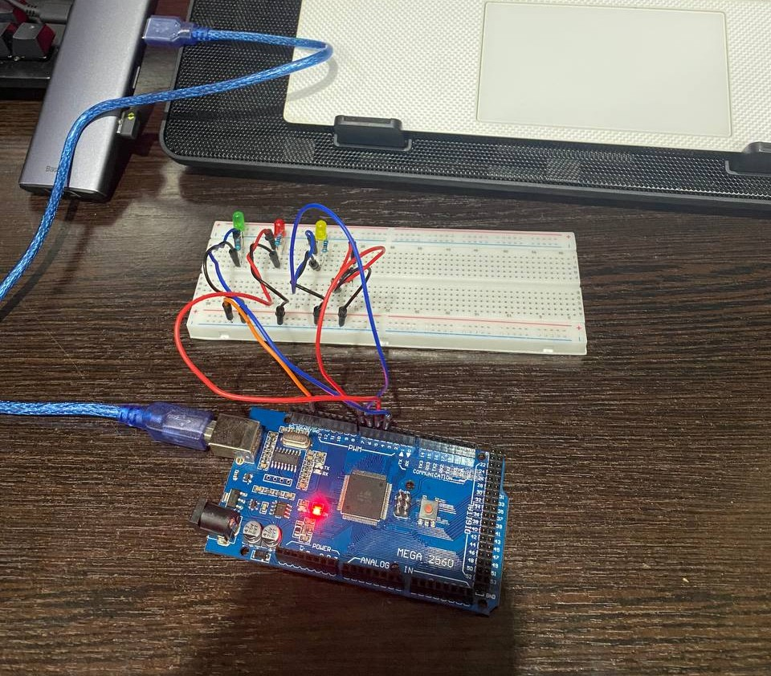

# Lab 2.2 — Preemptive Task Scheduling with FreeRTOS

## Objective
Port the Lab 2.1 application to a **preemptive RTOS** (FreeRTOS on Arduino Mega).
The same three-task behaviour is preserved — button monitoring, LED feedback, and
periodic statistics reporting — but task coordination now uses FreeRTOS primitives:
`vTaskDelayUntil`, a **binary semaphore** (T1 → T2 press event), and a **mutex**
(protecting the shared statistics counters between T2 and T3).

---

## Requirements

### Hardware Required
- **Microcontroller**: Arduino Mega 2560
- **Push button**: 1× momentary tactile (4-pin)
- **Green LED**: short-press feedback
- **Red LED**: long-press feedback
- **Yellow LED**: blink sequence (5× short, 10× long)
- **3× Resistors**: 220 Ω (red-red-brown-gold)
- **Breadboard**
- **Jumper wires**: male-to-male
- **USB cable**: Type-B (Arduino to PC)

### Software Required
- Visual Studio Code + PlatformIO extension
- Framework: Arduino
- Library: `feilipu/FreeRTOS@^11.1.0-3`
- Serial Monitor: 9600 baud

---

## Pin Connections

| Component | Arduino Pin | Notes |
|-----------|-------------|-------|
| Green LED | 4 | Short press indicator |
| Red LED | 5 | Long press indicator |
| Yellow LED | 6 | Blink feedback (Task 2) |
| Push button | 7 | Other leg → GND, INPUT_PULLUP enabled |

> Identical to Lab 2.1 — the breadboard wiring does not change.

---

## Physical Setup

### Step 0: Power Rails (do this FIRST)

Connect the Arduino power pins to the breadboard's power rails.

1. Jumper: Arduino **GND** → any hole on **top `−` rail**
2. Jumper: Arduino **5V** → any hole on **top `+` rail**

```
Arduino 5V  ──────→  [+ rail: ─────────────────────────────────────]
Arduino GND ──────→  [- rail: ─────────────────────────────────────]
```

---

### Green LED (Arduino pin 4)

```
top − rail: ────────────────────────────────────────────────────────
      col:   1   2   3   4   5
row a:               [+]  [-]          ← insert LED here
row b:               [J]   |           ← jumper from pin 4 here
row c:                    [=]          ← resistor
row d:                    [=]
row e:                    [G]──────────→ top − rail
```

Legend: `[+]` anode (long leg), `[-]` cathode (short leg), `[J]` jumper to Arduino, `[=]` resistor, `[G]` wire to GND rail

Steps:
1. LED long leg (anode) → **col 3, row a**
2. LED short leg (cathode) → **col 4, row a**
3. Resistor leg 1 → **col 4, row b** (same column as cathode = connected)
4. Resistor leg 2 → **col 4, row e**
5. Jumper: Arduino **pin 4** → **col 3, row b**
6. Jumper: **col 4, row e** → any hole on **top `−` rail**

Circuit: `Pin 4 → col 3 → LED → col 4 → 220 Ω → GND`

---

### Red LED (Arduino pin 5)

```
      col:   8   9   10  11  12
row a:               [+]  [-]
row b:               [J]   |
row c:                    [=]
row d:                    [=]
row e:                    [G]──────────→ top − rail
```

Steps:
1. LED long leg (anode) → **col 10, row a**
2. LED short leg (cathode) → **col 11, row a**
3. Resistor leg 1 → **col 11, row b**
4. Resistor leg 2 → **col 11, row e**
5. Jumper: Arduino **pin 5** → **col 10, row b**
6. Jumper: **col 11, row e** → any hole on **top `−` rail**

Circuit: `Pin 5 → col 10 → LED → col 11 → 220 Ω → GND`

---

### Yellow LED (Arduino pin 6)

```
      col:   15  16  17  18  19
row a:               [+]  [-]
row b:               [J]   |
row c:                    [=]
row d:                    [=]
row e:                    [G]──────────→ top − rail
```

Steps:
1. LED long leg (anode) → **col 17, row a**
2. LED short leg (cathode) → **col 18, row a**
3. Resistor leg 1 → **col 18, row b**
4. Resistor leg 2 → **col 18, row e**
5. Jumper: Arduino **pin 6** → **col 17, row b**
6. Jumper: **col 18, row e** → any hole on **top `−` rail**

Circuit: `Pin 6 → col 17 → LED → col 18 → 220 Ω → GND`

---

### Push Button (Arduino pin 7)

Place the button **horizontally** (long axis left-right) so the legs land in
rows e and f, straddling the centre gap.

```
         col 22   col 23   col 24
row d:    [   ]             [   ]   ← wire pin 7 here (e.g. col 22, row d)
row e:    [leg]   body      [leg]   ← top half  (col 22/e ↔ col 24/e, always bridged)
          ════════ GAP ════════
row f:    [leg]   body      [leg]   ← bottom half (col 22/f ↔ col 24/f, always bridged)
row g:    [   ]             [   ]   ← wire GND here (e.g. col 22, row g)
```

Steps:
1. Push the button down so top legs sit in **row e** (cols 22 and 24) and bottom legs in **row f**
2. Jumper: Arduino **pin 7** → **col 22, row d**
3. Jumper: **col 22, row g** → **`−` rail**

Circuit: `Pin 7 (INPUT_PULLUP) → col 22/row-e half → [press] → col 22/row-f half → GND`

---

### Complete Wiring Summary

```
Arduino Mega 2560
┌───────────────────┐
│  5V  ─────────────┼──→  + rail
│  GND ─────────────┼──→  − rail
│                   │
│  pin 4 ───────────┼──→  Green  LED anode  → cathode → 220 Ω → − rail
│  pin 5 ───────────┼──→  Red    LED anode  → cathode → 220 Ω → − rail
│  pin 6 ───────────┼──→  Yellow LED anode  → cathode → 220 Ω → − rail
│  pin 7 ───────────┼──→  Button one side
│                   │     Button other side → − rail
└───────────────────┘
```

LED current per resistor:

$$I_{LED} = \frac{V_{CC} - V_{LED}}{R} = \frac{5\text{ V} - 2\text{ V}}{220\text{ Ω}} \approx 13.6\text{ mA}$$

### Final Setup

*Assembled circuit with Arduino Mega 2560, green/red/yellow LEDs with 220 Ω resistors, and push button*

> **Note:** Breadboard wiring is identical to Lab 2.1 — only the Arduino board changes (Uno → Mega 2560).
> Replace the image above with a photo of your own assembled circuit.

---

## Software Architecture

### STDIO Mapping

| STDIO Stream | Redirected To |
|---|---|
| `stdout` (`printf`) | Serial / UART |
| `stdin` | Serial / UART (unused in this lab) |

`serialInit(9600)` installs both streams. Task 3 uses `printf()` for all reporting.

### FreeRTOS Scheduler

`vTaskStartScheduler()` is called at the end of `lab22Setup()` and never returns.
The RTOS tick is **1 ms** on AVR. The scheduler preempts the running task at every
tick and picks the highest-priority ready task — all three tasks are priority 1
(equal), so round-robin applies when more than one is ready.

```
  lab22Setup()
       │
  serialInit · buttonInit · statsInit · xSemaphoreCreateBinary
       │
  xTaskCreate × 3   (T1, T2, T3 all priority 1)
       │
  vTaskStartScheduler()  ◄── never returns; loop() never runs
       │
       ▼
  ╔═══════════════════════════════════════╗
  ║  FreeRTOS tick ISR  (every 1 ms)      ║
  ║  check each task's delay counter      ║
  ║  move expired tasks → Ready queue     ║
  ╚═══════════════════════════════════════╝
       │
  ┌────┴────────────────────────┐
  │  Scheduler picks next task  │
  │  (highest priority + ready) │
  └─────────────────────────────┘
        T1 runs          T2 runs          T3 runs
    vTaskDelayUntil   xSemaphoreTake   vTaskDelayUntil
     (50 ms)          (portMAX_DELAY)   (10 000 ms)
    → yields CPU      → yields CPU      → yields CPU
```

### Task Overview

| Task | Name | Scheduling | Role |
|------|------|------------|------|
| T1 | `taskButtonMonitor` | `vTaskDelayUntil` 50 ms | PROVIDER — polls button, signals T2 |
| T2 | `taskStatsAndBlink` | event-driven (`xSemaphoreTake`) | CONSUMER of T1, PRODUCER to Stats |
| T3 | `taskReport` | `vTaskDelayUntil` 10 000 ms | CONSUMER of Stats, prints report |

### Synchronisation Primitives

#### Binary Semaphore — `xPressEvent` (T1 → T2)

Replaces the `volatile sig_pressEvent` flag from Lab 2.1.  A semaphore is a
**signal**: it carries no data, it only says "something happened".

```
  T1 detects press
       │
  writes sig_pressDuration, sig_pressIsShort   ← data written BEFORE Give
       │
  xSemaphoreGive(xPressEvent)  ──────────────► semaphore = 1
                                                     │
                                               T2 unblocks
                                               xSemaphoreTake returns pdTRUE
                                               reads snapshot → processes
                                               xSemaphoreTake again → blocks
```

#### Mutex — `s_mutex` inside `lib/Stats/` (T2 ↔ T3)

Protects the five shared counters (`s_total`, `s_short`, `s_long`, `s_shortMs`,
`s_longMs`).  A mutex has **ownership** — the task that takes it must give it
back before another task can take it.

```
  T2 calls statsSetPress():        T3 calls statsGetAndReset():
  ┌─ xSemaphoreTake(s_mutex) ┐     ┌─ xSemaphoreTake(s_mutex) ──► BLOCKED if T2 holds it
  │  s_total++  s_shortMs+=  │     │  *total = s_total               │
  │  ...                     │     │  ... read all counters   ◄───── unblocks after T2 gives
  └─ xSemaphoreGive(s_mutex) ┘     │  zero all counters
                                   └─ xSemaphoreGive(s_mutex)
```

### Provider / Consumer Data Flow

```
┌─────────────┐  xSemaphoreGive(xPressEvent)  ┌─────────────┐   statsSetPress()   ┌─────────────┐
│   Task 1    │  sig_pressDuration             │   Task 2    │   (mutex inside)    │   Task 3    │
│   Button    │ ──────────────────────────────►│  Stats +    │ ──────────────────► │   Report    │
│   Monitor   │  sig_pressIsShort              │   Blink     │                     │  (printf)   │
└─────────────┘                                └─────────────┘                     └─────────────┘
  PROVIDER                                    CONSUMER + PRODUCER                    CONSUMER
  (semaphore Give)                            (semaphore Take / mutex Take+Give)     (mutex Take+Give)
```

### Press Classification and LED Behaviour

```
  button released
        │
   duration < 500 ms ?
        │
   yes ─┴─ no
   │           │
   ▼           ▼
Green ON    Red ON        ← T1 turns on, waits 500 ms (vTaskDelay), turns off
500 ms      500 ms        ← then gives semaphore to wake T2
   │           │
   ▼           ▼          ← T2 wakes, calls statsSetPress(), then blinks yellow
Yellow ×5  Yellow ×10     ← each half-cycle = vTaskDelay(100 ms)
   │           │
   └─────┬─────┘
         ▼
     T2 blocks again on semaphore
```

| Duration | Classification | Feedback LED | Blink count |
|---|---|---|---|
| < 500 ms | Short press | Green ON for 500 ms | Yellow × 5 |
| ≥ 500 ms | Long press | Red ON for 500 ms | Yellow × 10 |

### Concurrent Timeline Example

```
time (ms)   T1-Btn (50 ms)       T2-Stats (event)       T3-Report (10 s)
────────────────────────────────────────────────────────────────────────
0           polls button          BLOCKED (semaphore)    BLOCKED (sleeping)
50          polls button          BLOCKED                BLOCKED
            ← PRESS DETECTED →
150         green LED ON
            vTaskDelay(500 ms) ── CPU freed ──────────── T3 sleeps, scheduler
                                                         can run T2/T3 if needed
650         green LED OFF
            xSemaphoreGive ──────► T2 UNBLOCKED
            vTaskDelayUntil                              BLOCKED
                                  statsSetPress() [mutex]
                                  blink yellow ×5
                                  vTaskDelay(100ms)×10
                                  → T1 polls in gaps
1650                              T2 BLOCKED again
10000                                                    WAKES UP
                                                         statsGetAndReset() [mutex]
                                                         printf report
                                                         vTaskDelayUntil
```

### Lab 2.1 vs Lab 2.2 Comparison

| Aspect | Lab 2.1 (bare-metal) | Lab 2.2 (FreeRTOS) |
|---|---|---|
| Board | Arduino Uno | Arduino Mega 2560 |
| Scheduler | Timer2 ISR + manual dispatch | FreeRTOS preemptive |
| Task timing | `Scheduler` period/offset counts | `vTaskDelayUntil` |
| T1 → T2 signal | `volatile sig_pressEvent` flag | Binary semaphore |
| T2 → T3 data | `volatile sig_stat*` variables | Mutex-protected Stats module |
| T2 blink | Non-blocking state machine (tick-driven) | `vTaskDelay` inside loop (yields CPU) |
| Blocking | Never (bare-metal can't block) | Allowed — task sleeps, CPU given to others |

---

## Module Reference for This Lab

| Module | Used for |
|--------|----------|
| `lib/Stats/` | Mutex-protected statistics store (setter/getter pattern) |
| `lib/Signals/` | Volatile shared variables (press duration, type) |
| `lib/Button/` | Non-blocking edge-detect + duration measurement |
| `lib/Led/` | Digital LED wrapper |
| `lib/Serial/` | UART STDIO — `printf` → serial monitor |

---

## How to Build and Run

### 1. Set Active Lab

In [src/main.cpp](../src/main.cpp):
```cpp
#define ACTIVE_LAB 4
```

### 2. Upload
```bash
pio run -e mega --target upload
```

### 3. Open Serial Monitor
```bash
pio device monitor   # 9600 baud
```

### Expected Serial Output

On startup:
```
Lab 2.2 ready (FreeRTOS). Press the button!
T1: ButtonMonitor  period=50ms
T2: StatsAndBlink  event-driven
T3: Report         period=10000ms
```

After pressing the button a few times, every 10 seconds:
```
=== Report (10s) ===
Total presses : 3
Short presses : 2
Long  presses : 1
Avg duration  : 412 ms
====================
```

### LED Behaviour
- **Green ON 500 ms** immediately after a short press (< 500 ms)
- **Red ON 500 ms** immediately after a long press (≥ 500 ms)
- **Yellow blinks 5×** (100 ms on/off) after a short press
- **Yellow blinks 10×** (100 ms on/off) after a long press
- All LEDs off at idle
