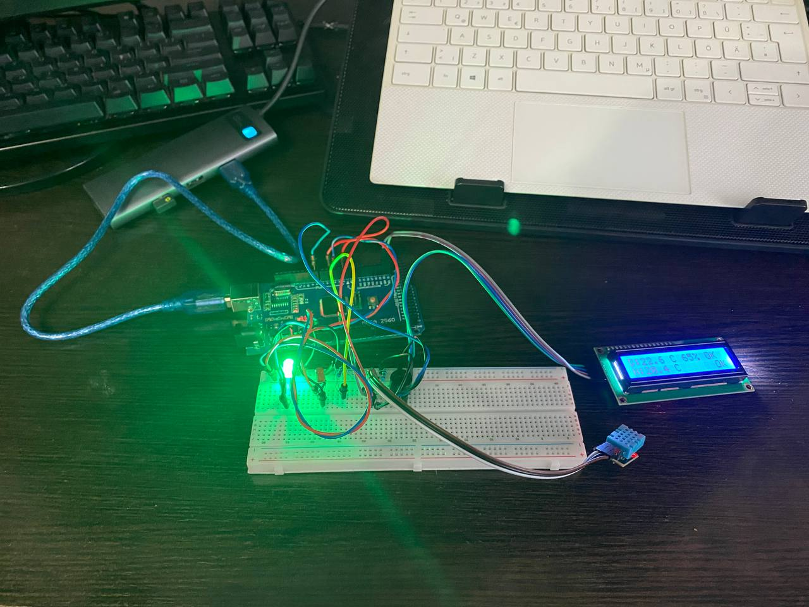

# Lab 3.1 — Binary Signal Conditioning with FreeRTOS

## Objective
Implement a **binary signal conditioning pipeline** (saturation → hysteresis → debounce)
for two sensors — a digital DHT11 (temperature + humidity) and an analog NTC thermistor
(temperature) — on an Arduino Mega 2560 running FreeRTOS.  The system classifies each
channel into OK / ALERT state and drives LEDs, a buzzer, and an LCD accordingly.

---

## Requirements

### Hardware Required
- **Microcontroller**: Arduino Mega 2560
- **DHT11 sensor**: digital temperature + humidity
- **NTC thermistor**: 10 kΩ @ 25 °C (analog temperature)
- **Resistor 10 kΩ**: pull-up for DHT11 data line
- **Resistor 10 kΩ**: fixed leg of NTC voltage divider
- **Green LED**: all-OK indicator
- **Red LED**: alert indicator
- **Passive buzzer**: new-alert beep
- **2× Resistors 220 Ω**: LED current limiting
- **LCD 16×2 I2C**: display (address 0x27, 5 V, SDA/SCL)
- **Breadboard**
- **Jumper wires**: male-to-male
- **USB cable**: Type-B (Arduino to PC)

### Software Required
- Visual Studio Code + PlatformIO extension
- Framework: Arduino
- Libraries: `feilipu/FreeRTOS@^11.1.0-3`, `adafruit/DHT sensor library@^1.4.6`
- Build flag: `-DUSE_FREERTOS` (guards Scheduler Timer2 ISR)

---

## Pin Connections

| Component | Arduino Pin | Notes |
|-----------|-------------|-------|
| Green LED | 4 | All-OK indicator, 220 Ω to GND |
| Red LED | 5 | Alert indicator, 220 Ω to GND |
| DHT11 data | 2 | 10 kΩ pull-up to 5 V |
| Passive buzzer | 8 | Positive leg to pin, negative to GND |
| NTC thermistor | A1 | Bottom leg of voltage divider (top → 5 V through 10 kΩ) |
| LCD SDA | 20 (SDA) | I2C data |
| LCD SCL | 21 (SCL) | I2C clock |
| LCD VCC | 5 V | Power |
| LCD GND | GND | Ground |

---

## Physical Setup

### Step 0: Power Rails (do this FIRST)

1. Jumper: Arduino **GND** → any hole on **top `−` rail**
2. Jumper: Arduino **5V** → any hole on **top `+` rail**

```
Arduino 5V  ──────→  [+ rail: ─────────────────────────────────────]
Arduino GND ──────→  [- rail: ─────────────────────────────────────]
```

---

### Green LED (Arduino pin 4)

```
      col:   1   2   3   4   5
row a:               [+]  [-]
row b:               [J]   |
row c:                    [=]
row d:                    [=]
row e:                    [G]──────────→ top − rail
```

Legend: `[+]` anode (long leg), `[-]` cathode (short leg), `[J]` jumper to Arduino, `[=]` resistor, `[G]` wire to GND rail

Steps:
1. LED long leg (anode) → **col 3, row a**
2. LED short leg (cathode) → **col 4, row a**
3. Resistor leg 1 → **col 4, row b**
4. Resistor leg 2 → **col 4, row e**
5. Jumper: Arduino **pin 4** → **col 3, row b**
6. Jumper: **col 4, row e** → any hole on **top `−` rail**

Circuit: `Pin 4 → col 3 → LED → col 4 → 220 Ω → GND`

---

### Red LED (Arduino pin 5)

```
      col:   8   9   10  11  12
row a:               [+]  [-]
row b:               [J]   |
row c:                    [=]
row d:                    [=]
row e:                    [G]──────────→ top − rail
```

Steps:
1. LED long leg (anode) → **col 10, row a**
2. LED short leg (cathode) → **col 11, row a**
3. Resistor leg 1 → **col 11, row b**
4. Resistor leg 2 → **col 11, row e**
5. Jumper: Arduino **pin 5** → **col 10, row b**
6. Jumper: **col 11, row e** → any hole on **top `−` rail**

Circuit: `Pin 5 → col 10 → LED → col 11 → 220 Ω → GND`

---

### DHT11 Sensor (Arduino pin 2)

The DHT11 has three pins: VCC, DATA, GND (left to right, vented face forward).

```
      col:   20  21  22
row a:       [V] [D] [G]     ← DHT11 legs plug in here
row b:       [J] [J]  [J]    ← rail/pin jumpers (same net as row a)
row c:           [=]         ← pull-up resistor leg 1 (DATA net)
row d:           [=]
                  └──────────→ leg 2 plugs directly into + rail strip
```

Steps:
1. DHT11 VCC leg → **col 20, row a**; jumper from **col 20, row b** → **`+` rail**
2. DHT11 GND leg → **col 22, row a**; jumper from **col 22, row b** → **`−` rail**
3. DHT11 DATA leg → **col 21, row a**
4. 10 kΩ pull-up: one leg → **col 21, row c** (DATA net); other leg → **`+` rail** directly
5. Jumper: Arduino **pin 2** → **col 21, row b**

> All holes in col 21, rows a–e are the same net. The centre gap (below row e)
> is a different bus — never use row f or below for the same signal.

Circuit: `5V → 10 kΩ → DATA ← pin 2`

---

### NTC Thermistor Voltage Divider (Arduino pin A1)

The NTC has no polarity — either leg can go up or down.  It forms a voltage
divider with a 10 kΩ fixed resistor:

```
  5 V (+ rail)
   │
  [=]  10 kΩ fixed resistor  ← leg 1 into + rail
  [=]
   ├──────────────────────────→ A1  (mid-point, read by ADC)
  [~]  NTC thermistor
  [~]
   │
  GND (− rail)               ← NTC leg 2 into − rail
```

Both components share the **mid-point** node — that is the A1 measurement point.

```
      col:   15
row a:       [R1]   ← 10 kΩ fixed, leg 1 → + rail directly
row b:       [R2]
row c:       [N1]   ← NTC leg 1, same net as R2 (mid-point = A1)
row d:       [N2]   ← NTC leg 2 → − rail directly
```

> R2 and N1 are in the same column, adjacent rows — they share the same internal
> bus so they are electrically connected (mid-point node).

Steps:
1. 10 kΩ resistor leg 1 → **`+` rail** directly (or **col 15, row a** with a rail jumper)
2. 10 kΩ resistor leg 2 → **col 15, row b**
3. NTC leg 1 → **col 15, row c** (same bus as row b = mid-point)
4. NTC leg 2 → **`−` rail** directly (or **col 15, row d** with a rail jumper)
5. Jumper: **col 15, row b or c** → Arduino **A1**

As temperature rises the NTC resistance falls → voltage at A1 rises → ADC value increases.

---

### Passive Buzzer (Arduino pin 8)

The buzzer body is round and physically spans roughly cols 26–28 — keep cols
27–28 free of other components.

```
      col:   26  27  28
row a:       [+]  ·  [-]     ← buzzer legs (body spans all three)
row b:       [J]       |
row c:                 └──────→ − rail
```

Steps:
1. Buzzer `+` leg → **col 26, row a**
2. Buzzer `−` leg → **col 28, row a**; jumper from **col 28, row e** → **`−` rail**
3. Jumper: Arduino **pin 8** → **col 26, row e**

Circuit: `Pin 8 → buzzer → GND`

---

### LCD 16×2 I2C

Connect the four pins of the I2C backpack directly with jumper wires — no
breadboard rows needed.

| LCD pin | Arduino Mega |
|---------|--------------|
| VCC | 5 V |
| GND | GND |
| SDA | pin 20 |
| SCL | pin 21 |

---

### Complete Wiring Summary

```
Arduino Mega 2560
┌───────────────────┐
│  5V  ─────────────┼──→  + rail
│  GND ─────────────┼──→  − rail
│                   │
│  pin 2 ───────────┼──→  DHT11 DATA  (10 kΩ pull-up to 5 V)
│  pin 4 ───────────┼──→  Green LED anode  → cathode → 220 Ω → − rail
│  pin 5 ───────────┼──→  Red   LED anode  → cathode → 220 Ω → − rail
│  pin 8 ───────────┼──→  Buzzer + leg     → − leg   → − rail
│  A1   ────────────┼──→  NTC mid-point (10 kΩ fixed above, NTC below to GND)
│  pin 20 (SDA) ────┼──→  LCD SDA
│  pin 21 (SCL) ────┼──→  LCD SCL
└───────────────────┘
```

LED current:

$$I_{LED} = \frac{V_{CC} - V_{LED}}{R} = \frac{5\text{ V} - 2\text{ V}}{220\text{ Ω}} \approx 13.6\text{ mA}$$

NTC mid-point voltage at temperature $T$ (where $R_{NTC}(T)$ is the thermistor resistance):

$$V_{A1} = 5\text{ V} \times \frac{R_{NTC}(T)}{R_{fixed} + R_{NTC}(T)}$$

### Final Setup


---

## Signal Conditioning Pipeline

Each sensor channel passes through a three-stage pipeline:

```
  raw value
      │
  ┌───▼──────────────────────────────────┐
  │  Stage 1 — Saturation                │
  │  clamp raw to [minVal, maxVal]        │
  └───┬──────────────────────────────────┘
      │  saturated value  (stored for display)
  ┌───▼──────────────────────────────────┐
  │  Stage 2 — Hysteresis comparator     │
  │  value >= threshHigh  → wantAlert    │
  │  value <= threshLow   → wantOK       │
  │  between thresholds   → hold         │
  └───┬──────────────────────────────────┘
      │  wantAlert (bool)
  ┌───▼──────────────────────────────────┐
  │  Stage 3 — Debounce counter          │
  │  counter++ if wantAlert else counter--|
  │  latch alertState when counter hits  │
  │  0 or debounceMax                    │
  └───┬──────────────────────────────────┘
      │  alertState (bool, stable output)
```

### Channel Thresholds

| Channel | Saturation range | Alert ON (≥) | Alert OFF (≤) | Debounce |
|---------|-----------------|-------------|--------------|---------|
| DHT11 temperature | −10 … 60 °C | 28 °C | 25 °C | 5 samples (250 ms) |
| DHT11 humidity | 0 … 100 %RH | 70 %RH | 60 %RH | 5 samples (250 ms) |
| NTC temperature | −10 … 60 °C | 28 °C | 25 °C | 5 samples (250 ms) |

---

## Software Architecture

### STDIO Mapping

| STDIO stream | Redirected to |
|---|---|
| `stdout` (`printf`) | LCD 16×2 via `lcdInit()` |

`lcdInit()` is called in `lab31Setup()` and installs `printf` → LCD.

### FreeRTOS Scheduler

`vTaskStartScheduler()` is called at the end of `lab31Setup()` and never returns.

```
  lab31Setup()
       │
  lcdInit · dhtInit · ntcInit · buzzerInit · bcInit ×3
       │
  xSemaphoreCreateMutex · xSemaphoreCreateBinary
       │
  xTaskCreate × 3   (T1 priority 2, T2 priority 2, T3 priority 1)
       │
  vTaskStartScheduler()  ◄── never returns; loop() never runs
```

### Task Overview

| Task | Function | Scheduling | Role |
|------|----------|------------|------|
| T1 | `taskAcquisition` | `vTaskDelayUntil` 50 ms | PROVIDER — reads DHT11 + NTC, gives semaphore |
| T2 | `taskConditioning` | event-driven (`xSemaphoreTake`) | CONSUMER of T1 — conditions signals, drives outputs |
| T3 | `taskDisplay` | `vTaskDelayUntil` 500 ms | CONSUMER of T2 — reads report, writes LCD |

### Synchronisation Primitives

#### Binary Semaphore — `s_newSample` (T1 → T2)

```
  T1 reads DHT11 + NTC
       │
  xSemaphoreGive(s_newSample) ─────────────► semaphore = 1
                                                   │
                                             T2 unblocks
                                             runs conditioning pipeline
                                             xSemaphoreTake again → blocks
```

#### Mutex — `s_reportMutex` (T2 ↔ T3)

Protects the `SensorReport` struct that T2 writes and T3 reads.

```
  T2 writes report:                  T3 reads report:
  ┌─ xSemaphoreTake(s_reportMutex)   ┌─ xSemaphoreTake(s_reportMutex) ──► BLOCKED if T2 holds
  │  s_report.dhtTempRaw = ...       │  r = s_report   (local copy)
  │  ...                             └─ xSemaphoreGive(s_reportMutex)
  └─ xSemaphoreGive(s_reportMutex)
```

### Provider / Consumer Data Flow

```
┌─────────────┐  xSemaphoreGive(s_newSample)  ┌─────────────┐  s_reportMutex  ┌─────────────┐
│     T1      │  DHT11 + NTC ADC values        │     T2      │  SensorReport   │     T3      │
│ Acquisition │ ────────────────────────────► │Conditioning │ ───────────────►│   Display   │
│  (50 ms)    │                               │ (event)     │                 │  (500 ms)   │
└─────────────┘                               └─────────────┘                 └─────────────┘
  PROVIDER                                   CONSUMER + PRODUCER               CONSUMER
```

### LCD Display Format

```
Row 0  (DHT11):   D:24.5C 62%  OK
Row 1  (NTC):     N:23.8C r: 412 OK
```

Alert flags replace `OK` with `!T` (temperature alert) and/or `!H` (humidity alert).
If DHT11 has not yet produced a valid reading: `D: waiting...`

### Concurrent Timeline Example

```
time (ms)  T1-Acq (50 ms)    T2-Cond (event)         T3-Disp (500 ms)
───────────────────────────────────────────────────────────────────────
0          reads sensors       BLOCKED (semaphore)     BLOCKED (sleeping)
           xSemaphoreGive ───► T2 UNBLOCKED
                               conditions 3 channels
                               updates LEDs, buzzer
                               writes s_report [mutex]
                               T2 BLOCKED again
50         reads sensors
           xSemaphoreGive ───► T2 UNBLOCKED
...
500                                                    WAKES UP
                                                       reads s_report [mutex]
                                                       writes LCD
                                                       vTaskDelayUntil
```

---

## Module Reference

| Module | Used for |
|--------|----------|
| `lib/DhtSensor/` | DHT11 driver — internal 1 s read gate, temp + humidity |
| `lib/NtcSensor/` | NTC ADC read + 2-point linear temperature conversion |
| `lib/BinaryConditioner/` | Saturation + hysteresis + debounce pipeline |
| `lib/Buzzer/` | Passive buzzer — `buzzerBeep(ms)` blocking, 1 kHz |
| `lib/Lcd/` | LCD I2C wrapper, redirects `printf` to display |
| `lib/Led/` | Digital LED wrapper |

---

## How to Build and Run

### 1. Set Active Lab

In [src/main.cpp](../src/main.cpp):
```cpp
#define ACTIVE_LAB 5
```

### 2. Upload
```bash
pio run -e mega --target upload
```

### Expected LCD Output

At startup (row 0):
```
Lab 3.1 ready
```

During normal operation:
```
Row 0:  D:24.5C 62%  OK
Row 1:  N:23.8C r: 412 OK
```

When temperature exceeds 28 °C:
```
Row 0:  D:29.1C 55%  !T
Row 1:  N:29.3C r: 756 !T
```
The red LED turns on and the buzzer emits a 150 ms beep on the first
cycle that the conditioned alert latches.

### LED Behaviour
- **Green ON** — all three channels OK
- **Red ON** — at least one channel in ALERT state
- LEDs are mutually exclusive (only one on at a time)
- **Buzzer beeps 150 ms** once when any channel transitions OK → ALERT
