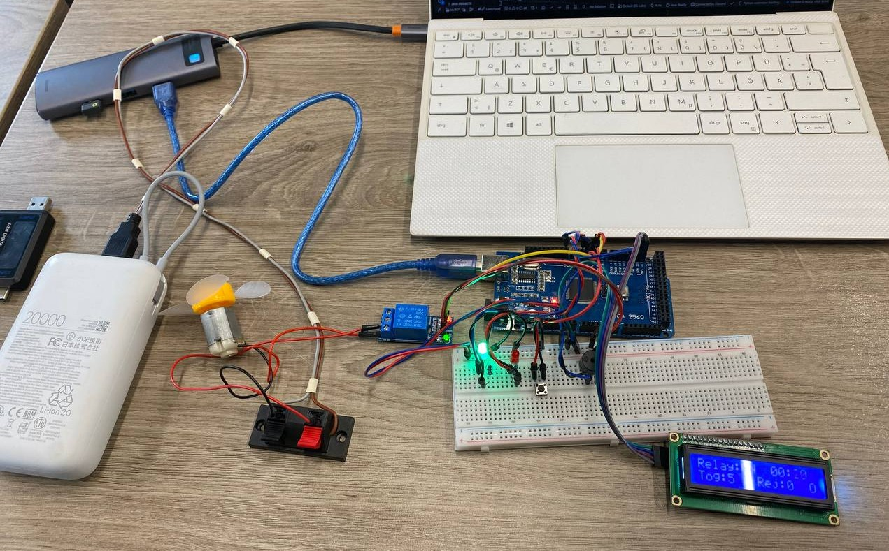

# Lab 4.1 — Binary Actuator Control with FreeRTOS

## Objective
Implement a **binary actuator control system** using a relay module on an Arduino
Mega 2560 running FreeRTOS.  The system receives serial commands (`on`, `off`,
`toggle`, `status`), applies **output debouncing** (minimum hold-time conditioning)
to prevent relay chatter, and drives the relay alongside LED/buzzer feedback and
an LCD/Serial status display.

---

## Requirements

### Hardware Required
- **Microcontroller**: Arduino Mega 2560
- **5 V Relay module**: single-channel, optocoupler-isolated (active-LOW IN)
- **Green LED**: relay ON indicator
- **Red LED**: relay OFF indicator
- **Passive buzzer**: command feedback beep
- **2× Resistors 220 Ω**: LED current limiting
- **Push button**: toggle relay (INPUT_PULLUP, press to GND)
- **DC motor (fan)**: relay-switched load on NO/COM contacts
- **LCD 16×2 I2C**: status display (address 0x27, 5 V, SDA/SCL)
- **Breadboard**
- **Jumper wires**: male-to-male
- **USB cable**: Type-B (Arduino to PC)

### Software Required
- Visual Studio Code + PlatformIO extension
- Framework: Arduino
- Libraries: `feilipu/FreeRTOS@^11.1.0-3`
- Build flag: `-DUSE_FREERTOS` (guards Scheduler Timer2 ISR)

---

## Pin Connections

| Component        | Arduino Pin | Notes                                   |
|------------------|-------------|-----------------------------------------|
| Relay IN         | 3           | Active-LOW, optocoupler relay module    |
| Green LED        | 4           | Relay ON indicator, 220 Ω to GND       |
| Red LED          | 5           | Relay OFF indicator, 220 Ω to GND      |
| Push button      | 2           | INPUT_PULLUP, other leg to GND          |
| Passive buzzer   | 8           | Positive leg to pin, negative to GND    |
| DC motor +       | Relay NO    | Normally-Open contact                   |
| DC motor −       | GND         | Common ground                           |
| Relay COM        | 5 V         | Power routed through relay to motor     |
| Relay VCC        | 5 V         | Power for relay coil driver             |
| Relay GND        | GND         | Common ground                           |
| LCD SDA          | 20 (SDA)    | I2C data                                |
| LCD SCL          | 21 (SCL)    | I2C clock                               |
| LCD VCC          | 5 V         | Power                                   |
| LCD GND          | GND         | Ground                                  |

---

## Physical Setup

### Step 0: Power Rails (do this FIRST)

1. Jumper: Arduino **GND** → any hole on **top `−` rail**
2. Jumper: Arduino **5V** → any hole on **top `+` rail**

```
Arduino 5V  ──────→  [+ rail: ─────────────────────────────────────]
Arduino GND ──────→  [- rail: ─────────────────────────────────────]
```

---

### Green LED (Arduino pin 4)

```
      col:   1   2   3   4   5
row a:               [+]  [-]
row b:               [J]   |
row c:                    [=]
row d:                    [=]
row e:                    [G]──────────→ top − rail
```

Steps:
1. LED long leg (anode) → **col 3, row a**
2. LED short leg (cathode) → **col 4, row a**
3. Resistor 220 Ω leg 1 → **col 4, row b**
4. Resistor 220 Ω leg 2 → **col 4, row e**
5. Jumper: Arduino **pin 4** → **col 3, row b**
6. Jumper: **col 4, row e** → **`−` rail**

Circuit: `Pin 4 → col 3 → LED → col 4 → 220 Ω → GND`

---

### Red LED (Arduino pin 5)

```
      col:   8   9   10  11  12
row a:               [+]  [-]
row b:               [J]   |
row c:                    [=]
row d:                    [=]
row e:                    [G]──────────→ top − rail
```

Steps:
1. LED long leg (anode) → **col 10, row a**
2. LED short leg (cathode) → **col 11, row a**
3. Resistor 220 Ω leg 1 → **col 11, row b**
4. Resistor 220 Ω leg 2 → **col 11, row e**
5. Jumper: Arduino **pin 5** → **col 10, row b**
6. Jumper: **col 11, row e** → **`−` rail**

Circuit: `Pin 5 → col 10 → LED → col 11 → 220 Ω → GND`

---

### Passive Buzzer (Arduino pin 8)

```
      col:   26  27  28
row a:       [+]  ·  [-]     ← buzzer legs
row b:       [J]       |
row c:                 └──────→ − rail
```

Steps:
1. Buzzer `+` leg → **col 26, row a**
2. Buzzer `−` leg → **col 28, row a**; jumper from **col 28, row e** → **`−` rail**
3. Jumper: Arduino **pin 8** → **col 26, row e**

Circuit: `Pin 8 → buzzer → GND`

---

### Push Button (Arduino pin 2)

```
      col:   15  16
row a:       [B]  [B]   ← button legs straddle the center gap
row e:       [J]   |
row f:              └──────→ − rail (GND)
```

Steps:
1. Button leg 1 → **col 15, row a**
2. Button leg 2 → **col 16, row a** (across center gap)
3. Jumper: Arduino **pin 2** → **col 15, row e**
4. Jumper: **col 16, row f** → **`−` rail**

Circuit: `Pin 2 (INPUT_PULLUP) → button → GND`

---

### 5 V Relay Module (Arduino pin 3)

The relay module has three header pins: **VCC**, **IN**, **GND**.

```
  Relay Module
  ┌──────────────────┐
  │  VCC  IN  GND    │
  │   │    │    │    │
  └───┼────┼────┼────┘
      │    │    │
      │    │    └──→ − rail (GND)
      │    └───────→ Arduino pin 3
      └────────────→ + rail (5 V)
```

Steps:
1. Relay **VCC** → **`+` rail** (5 V)
2. Relay **GND** → **`−` rail** (GND)
3. Relay **IN**  → Arduino **pin 3**

> The relay module is **active-LOW**: pulling IN to LOW energises the coil.
> The software handles the inversion via `RELAY_ACTIVE_LOW = 1`.

The relay has screw-terminal outputs (**COM**, **NO**, **NC**) for switching an
external load.  For lab testing, the relay's on-board LED and audible click
provide sufficient feedback without connecting a load.

---

### LCD 16×2 I2C

Connect the four pins of the I2C backpack directly with jumper wires.

| LCD pin | Arduino Mega |
|---------|--------------|
| VCC     | 5 V          |
| GND     | GND          |
| SDA     | pin 20       |
| SCL     | pin 21       |

---

### Complete Wiring Summary

```
Arduino Mega 2560
┌───────────────────┐
│  5V  ─────────────┼──→  + rail ──→ Relay VCC, Relay COM
│  GND ─────────────┼──→  − rail ──→ Relay GND
│                   │
│  pin 2  ──────────┼──→  Button (INPUT_PULLUP) → other leg → − rail
│  pin 3  ──────────┼──→  Relay IN (active-LOW)
│  pin 4  ──────────┼──→  Green LED anode  → cathode → 220 Ω → − rail
│  pin 5  ──────────┼──→  Red   LED anode  → cathode → 220 Ω → − rail
│  pin 8  ──────────┼──→  Buzzer + leg     → − leg   → − rail
│  pin 20 (SDA) ────┼──→  LCD SDA
│  pin 21 (SCL) ────┼──→  LCD SCL
│                   │
│  Relay NO ────────┼──→  Motor + (switched load)
│  Motor − ─────────┼──→  − rail (GND)
└───────────────────┘
```

LED current:

$$I_{LED} = \frac{V_{CC} - V_{LED}}{R} = \frac{5\text{ V} - 2\text{ V}}{220\text{ Ω}} \approx 13.6\text{ mA}$$

### Final Setup


---

## Software Architecture

### FreeRTOS 3-Task Pipeline

```
Serial ───┐
           ├──→ [ T1: Command Parser ] ──semaphore──→ [ T2: Condition + Control ] ──mutex──→ [ T3: Display ]
Button ───┘       50 ms poll                            event-driven                           500 ms refresh
```

### Task 1 — Command Parser (Priority 2, 50 ms)
- Non-blocking serial character accumulation
- Parses complete lines into commands: `on`, `off`, `toggle`, `status`
- Polls push button via `buttonUpdate()`; press triggers `toggle`
- Stores command code and gives binary semaphore to T2

### Task 2 — Conditioning & Control (Priority 2, event-driven)
- Blocks on binary semaphore from T1
- Applies **output debouncing** via `OutputDebounce` module (500 ms minimum hold)
- Drives relay via `Relay` module
- Updates LED indicators (green = ON, red = OFF)
- Buzzer feedback: single beep (accepted), double beep (rejected)
- Writes `ActuatorReport` struct (mutex-protected)

### Task 3 — Display (Priority 1, 500 ms)
- Reads `ActuatorReport` under mutex
- LCD row 0: `Relay:ON  MM:SS` (state + time in current state)
- LCD row 1: `Tog:nnn Rej:nnn S` (toggle count, reject count, last status)
- Serial: detailed report + plotter-compatible output

### Output Debounce Conditioning

The `OutputDebounce` module enforces a minimum hold time before accepting a
state change request.  This prevents relay chatter from rapid command sequences:

```
Command → [OutputDebounce: 500 ms min hold] → Relay driver
              │                                    │
              ├── Accepted → toggle count++        ├── relayOn() / relayOff()
              └── Rejected → reject count++        └── (no change)
```

---

## New Library Modules

### `lib/Relay/`
Thin C-style hardware driver for single-channel relay control.  Supports
active-LOW modules via compile-time `RELAY_ACTIVE_LOW` flag.

| Function         | Description                        |
|------------------|------------------------------------|
| `relayInit()`    | Set pin as OUTPUT, relay OFF       |
| `relayOn()`      | Energise coil (close contacts)     |
| `relayOff()`     | De-energise coil (open contacts)   |
| `relayToggle()`  | Flip current state                 |
| `relayGetState()`| Returns true if relay is ON        |

### `lib/OutputDebounce/`
Struct-based output signal conditioner.  Caller configures `minHoldMs`, then
calls `odRequest()` for each command.

| Function             | Description                              |
|----------------------|------------------------------------------|
| `odInit()`           | Reset state and counters                 |
| `odRequest()`        | Request state change; returns accepted   |
| `odGetState()`       | Current debounced state                  |
| `odGetToggleCount()` | Number of accepted toggles               |
| `odGetRejections()`  | Number of rejected requests              |
| `odGetHeldMs()`      | Milliseconds in current state            |

---

## Serial Commands

| Command  | Action                                   |
|----------|------------------------------------------|
| `on`     | Request relay ON (subject to debounce)   |
| `off`    | Request relay OFF (subject to debounce)  |
| `toggle` | Request relay toggle (subject to debounce)|
| `status` | Print current status (no actuator change)|

---

## How to Run

1. Set `ACTIVE_LAB` to `7` in `src/main.cpp`
2. Build and upload: `pio run -e mega -t upload`
3. Open Serial Monitor at **9600 baud**
4. Type commands (`on`, `off`, `toggle`, `status`) and press Enter
5. Press the push button to toggle the relay
