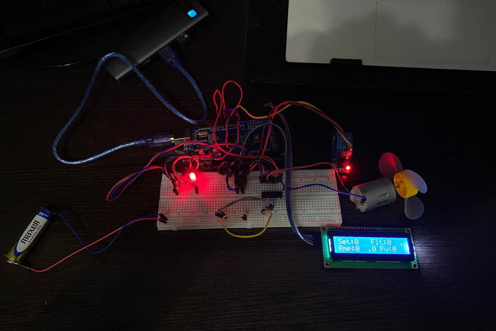

# Lab 4.2 — Combined Binary & Analog Actuator Control with FreeRTOS

## Objective
Implement a **combined actuator control system** (Variant C — 100 % grade) on an
Arduino Mega 2560 running FreeRTOS.  A single application drives both a
**relay** (binary actuator, output-debounced) and a **DC motor** via an
**L293D H-bridge** (analog/PWM actuator) with a full signal-conditioning
pipeline: saturation → median filter → exponential moving average → slew-rate
ramp.  All commands are issued over the serial port; an I2C LCD shows alternating
relay and motor status pages.

---

## Requirements

### Hardware Required
- **Microcontroller**: Arduino Mega 2560
- **5 V Relay module**: single-channel, optocoupler-isolated (active-LOW IN)
- **L293D motor driver IC**: dual H-bridge, mounted on breadboard
- **3 V DC motor** (or equivalent small motor from LAFVIN kit)
- **Green LED**: relay ON indicator
- **Red LED**: relay OFF indicator
- **Passive buzzer**: command feedback beep
- **4× Resistors 220 Ω**: LED current limiting (2 for status LEDs, 2 for motor simulation LEDs in Wokwi)
- **LCD 16×2 I2C**: status display (address 0x27, 5 V, SDA/SCL)
- **Breadboard**
- **Jumper wires**: male-to-male
- **USB cable**: Type-B (Arduino to PC)

### Software Required
- Visual Studio Code + PlatformIO extension
- Framework: Arduino
- Libraries: `feilipu/FreeRTOS@^11.1.0-3`
- Build flag: `-DUSE_FREERTOS` (guards Scheduler Timer2 ISR)

---

## Pin Connections

| Component          | Arduino Pin | Notes                                      |
|--------------------|-------------|--------------------------------------------|
| Relay IN           | 3           | Active-LOW, optocoupler relay module       |
| Green LED          | 4           | Relay ON indicator, 220 Ω to GND          |
| Red LED            | 5           | Relay OFF indicator, 220 Ω to GND         |
| L293D Enable 1     | 6 (PWM)     | Motor speed (analogWrite 0–255)            |
| L293D Input 1      | 7           | Direction bit A                            |
| L293D Input 2      | 9           | Direction bit B                            |
| Passive buzzer     | 8           | Positive leg to pin, negative to GND       |
| LCD SDA            | 20 (SDA)    | I2C data                                   |
| LCD SCL            | 21 (SCL)    | I2C clock                                  |
| Relay VCC          | 5 V         | Power for relay coil driver                |
| Relay GND          | GND         | Common ground                              |
| L293D pin 16 (Vs)  | 5 V         | Motor supply voltage                       |
| L293D pin 8 (Vss)  | 5 V         | Logic supply voltage                       |
| L293D GND (4,5,12,13) | GND      | All four ground pins tied to GND           |
| LCD VCC            | 5 V         | Power                                      |
| LCD GND            | GND         | Ground                                     |

---

## Physical Setup

### Step 0: Power Rails (do this FIRST)

1. Jumper: Arduino **GND** → any hole on **top `−` rail**
2. Jumper: Arduino **5V** → any hole on **top `+` rail**

```
Arduino 5V  ──────→  [+ rail: ─────────────────────────────────────]
Arduino GND ──────→  [- rail: ─────────────────────────────────────]
```

---

### Green LED (Arduino pin 4)

```
      col:   1   2   3   4   5
row a:               [+]  [-]
row b:               [J]   |
row c:                    [=]
row d:                    [=]
row e:                    [G]──────────→ top − rail
```

Steps:
1. LED long leg (anode) → **col 3, row a**
2. LED short leg (cathode) → **col 4, row a**
3. Resistor 220 Ω leg 1 → **col 4, row b**
4. Resistor 220 Ω leg 2 → **col 4, row e**
5. Jumper: Arduino **pin 4** → **col 3, row b**
6. Jumper: **col 4, row e** → **`−` rail**

Circuit: `Pin 4 → col 3 → LED → col 4 → 220 Ω → GND`

---

### Red LED (Arduino pin 5)

```
      col:   8   9   10  11  12
row a:               [+]  [-]
row b:               [J]   |
row c:                    [=]
row d:                    [=]
row e:                    [G]──────────→ top − rail
```

Steps:
1. LED long leg (anode) → **col 10, row a**
2. LED short leg (cathode) → **col 11, row a**
3. Resistor 220 Ω leg 1 → **col 11, row b**
4. Resistor 220 Ω leg 2 → **col 11, row e**
5. Jumper: Arduino **pin 5** → **col 10, row b**
6. Jumper: **col 11, row e** → **`−` rail**

Circuit: `Pin 5 → col 10 → LED → col 11 → 220 Ω → GND`

---

### Passive Buzzer (Arduino pin 8)

```
      col:   26  27  28
row a:       [+]  ·  [-]     ← buzzer legs
row b:       [J]       |
row c:                 └──────→ − rail
```

Steps:
1. Buzzer `+` leg → **col 26, row a**
2. Buzzer `−` leg → **col 28, row a**; jumper from **col 28, row e** → **`−` rail**
3. Jumper: Arduino **pin 8** → **col 26, row e**

Circuit: `Pin 8 → buzzer → GND`

---

### L293D Motor Driver

The L293D is a 16-pin DIP IC.  Place it across the **center gap** of the
breadboard so each row of pins sits in a different half.  The notch (or dot
marking pin 1) faces **left**.  The text on the chip reads **horizontally**,
left → right.

**Pinout reference** (top view, notch on left):

```
              pin 1                        pin 8
                ▼                            ▼
        ┌───────────────────────────────────────┐
        │ ●                                     │
  EN1 ──┤ 1   2   3   4   5   6   7   8 ├── Vss
  IN1 ──┤     │   │   │   │   │   │        │
 OUT1 ──┤     IN1 OUT1 GND GND OUT2 IN2    │
  GND ──┤                                     │
  GND ──┤  L  2  9  3  D                      │
 OUT2 ──┤                                     │
  IN2 ──┤ 16  15  14  13  12  11  10  9 ├── EN2
  Vss ──┤ │   │   │   │   │   │   │        │
        │ Vs  IN4 OUT4 GND GND OUT3 IN3    │
        └───────────────────────────────────────┘
                ▲                            ▲
             pin 16                       pin 9
```

**Breadboard placement** (columns 35–42):

```
          col:  35   36   37   38   39   40   41   42
               EN1  IN1  OUT1 GND  GND  OUT2 IN2  Vss
               (1)  (2)  (3)  (4)  (5)  (6)  (7)  (8)
        row e:  ●    ●    ●    ●    ●    ●    ●    ●
               ══════════════════════════════════════════  ← center gap
        row f:  ●    ●    ●    ●    ●    ●    ●    ●
               (16) (15) (14) (13) (12) (11) (10)  (9)
               Vs   IN4  OUT4 GND  GND  OUT3 IN3  EN2
```

- **Row e** = top half of breadboard (pins 1–8)
- **Row f** = bottom half of breadboard (pins 9–16)
- Pin numbers increase left→right on top, right→left on bottom (standard DIP)

Steps:
1. Place L293D across the center gap, notch facing left (pin 1 = col 35, row e)
2. **col 35, row a** → jumper to Arduino **pin 6** (EN1 — PWM speed)
3. **col 36, row a** → jumper to Arduino **pin 7** (IN1 — direction A)
4. **col 41, row a** → jumper to Arduino **pin 9** (IN2 — direction B)
5. **col 42, row a** → jumper to **`+` rail** (Vss — 5 V logic supply)
6. **col 35, row j** → jumper to **`+` rail** (Vs — 5 V motor supply)
7. **col 38, row a** + **col 39, row a** → jumper to **`−` rail** (GND pins 4, 5)
8. **col 38, row j** + **col 39, row j** → jumper to **`−` rail** (GND pins 12, 13)
9. **col 37, row a** (OUT1) → motor terminal 1
10. **col 40, row a** (OUT2) → motor terminal 2

> You connect to the L293D through the **other rows** in the same column (e.g.
> row a–d share a column with pin in row e; row f–j share a column with pin in
> row f).  Never plug a jumper into the same hole as the IC pin — use an
> adjacent row in the same column.

Circuit: `Arduino pin 6 (PWM) → EN1`, `pin 7 → IN1`, `pin 9 → IN2` → L293D
drives motor via OUT1/OUT2

---

### 5 V Relay Module (Arduino pin 3)

```
  Relay Module
  ┌──────────────────┐
  │  VCC  IN  GND    │
  │   │    │    │    │
  └───┼────┼────┼────┘
      │    │    │
      │    │    └──→ − rail (GND)
      │    └───────→ Arduino pin 3
      └────────────→ + rail (5 V)
```

Steps:
1. Relay **VCC** → **`+` rail** (5 V)
2. Relay **GND** → **`−` rail** (GND)
3. Relay **IN**  → Arduino **pin 3**

> The relay module is **active-LOW**: pulling IN to LOW energises the coil.
> No load is connected to the screw terminals; the on-board LED and audible
> click serve as feedback.

---

### LCD 16×2 I2C

| LCD pin | Arduino Mega |
|---------|--------------|
| VCC     | 5 V          |
| GND     | GND          |
| SDA     | pin 20       |
| SCL     | pin 21       |

---

### Complete Wiring Summary

```
Arduino Mega 2560
┌───────────────────┐
│  5V  ─────────────┼──→  + rail ──→ Relay VCC, L293D Vs/Vss
│  GND ─────────────┼──→  − rail ──→ Relay GND, L293D GND×4
│                   │
│  pin 3  ──────────┼──→  Relay IN (active-LOW)
│  pin 4  ──────────┼──→  Green LED anode  → cathode → 220 Ω → − rail
│  pin 5  ──────────┼──→  Red   LED anode  → cathode → 220 Ω → − rail
│  pin 6  ──────────┼──→  L293D EN1 (PWM speed)
│  pin 7  ──────────┼──→  L293D IN1 (direction A)
│  pin 8  ──────────┼──→  Buzzer + leg     → − leg   → − rail
│  pin 9  ──────────┼──→  L293D IN2 (direction B)
│  pin 20 (SDA) ────┼──→  LCD SDA
│  pin 21 (SCL) ────┼──→  LCD SCL
│                   │
│  L293D OUT1/OUT2 ─┼──→  Motor terminals
└───────────────────┘
```

LED current:

$$I_{LED} = \frac{V_{CC} - V_{LED}}{R} = \frac{5\text{ V} - 2\text{ V}}{220\text{ Ω}} \approx 13.6\text{ mA}$$

### Final Setup


---

## Software Architecture

### FreeRTOS 4-Task Pipeline

```
Serial ──→ [ T1: Command Parser ] ──queue──→ [ T2: Relay Control ]     ──mutex──→ [ T4: Display ]
               50 ms poll           relay     event-driven (prio 3)     report      500 ms refresh
                                    cmds
                                  ──queue──→ [ T3: Motor Conditioning ] ──mutex──→ [ T4: Display ]
                                    speed     50 ms (prio 3)
                                    cmds
```

### Task 1 — Command Parser (Priority 2, 50 ms)
- Non-blocking serial character accumulation via `serialLineReady()`
- Two-step `sscanf` parsing: first word + offset (`%s%n`), then argument from
  remaining buffer
- Routes relay commands (`on`, `off`, `toggle`) to `s_relayCmdQueue`
- Routes motor commands (`speed N`, `stop`, `max`) to `s_speedCmdQueue`
- `status` sends `CMD_STATUS` to relay queue for a combined status dump

### Task 2 — Relay Control (Priority 3, event-driven)
- Blocks on `s_relayCmdQueue` (`portMAX_DELAY`)
- Applies **output debouncing** via `OutputDebounce` module (500 ms minimum
  hold) before toggling the relay
- Drives green/red LED indicators
- Buzzer: single beep (accepted), double beep (rejected)
- Writes `RelayReport` struct under mutex

### Task 3 — Motor Conditioning (Priority 3, 50 ms)
- Drains `s_speedCmdQueue` (consumes all pending setpoints with `xQueueReceive`
  in a loop, effectively keeping only the latest)
- **Signal conditioning pipeline**: saturate [0–100 %] → MedianFilter(5) →
  EMA(α = 0.3) → Ramp(50 %/s up, 100 %/s down)
- Writes PWM to motor via `motorSetPercent()`
- Writes `MotorReport` struct under mutex

### Task 4 — Display (Priority 1, 500 ms)
- Reads both `RelayReport` and `MotorReport` under mutex
- **LCD page 0** (relay): `Relay:ON  MM:SS` / `T:nnn R:nnn  OK`
- **LCD page 1** (motor): `Set:NNN Flt:NNN.N` / `Rmp:NNN.N Pw:NNN%`
- Pages alternate every 500 ms
- Serial: compact one-line report for plotter/logging

### Signal Conditioning Pipeline (Motor)

```
   setpoint (0-100%)
       │
       ▼
  [ Saturate ]   clamp to [0, 100]
       │
       ▼
  [ MedianFilter(5) ]   removes impulse noise
       │
       ▼
  [ EMA α=0.3 ]   smooths rapid changes
       │
       ▼
  [ Ramp 50%/s ↑  100%/s ↓ ]   limits rate of change
       │
       ▼
  motorSetPercent()  → analogWrite(EN1, 0–255)
```

### Output Debounce (Relay)

```
Command → [OutputDebounce: 500 ms min hold] → Relay driver
              │                                    │
              ├── Accepted → toggle count++        ├── relayOn() / relayOff()
              └── Rejected → reject count++        └── (no change)
```

---

## New Library Modules

### `lib/MotorDriver/`
C-style driver for L293D H-bridge.  Forward direction (IN1=HIGH, IN2=LOW) by
default.

| Function           | Description                              |
|--------------------|------------------------------------------|
| `motorInit()`      | Set EN1/IN1/IN2 as OUTPUT, motor stopped |
| `motorSetSpeed(v)` | Raw PWM 0–255                            |
| `motorSetPercent(p)`| Speed as percentage 0.0–100.0           |
| `motorStop()`      | Coast stop (EN1=LOW)                     |
| `motorBrake()`     | Electrical brake (IN1=IN2=HIGH)          |
| `motorGetSpeed()`  | Current raw PWM                          |
| `motorGetPercent()`| Current percent                          |

### `lib/Ramp/`
Linear slew-rate limiter with independent up/down rates.

| Function            | Description                             |
|---------------------|-----------------------------------------|
| `rampInit()`        | Reset value and target to 0             |
| `rampSetTarget(t)`  | Set the ramp's target value             |
| `rampUpdate(dt)`    | Advance ramp by dt seconds, return value|
| `rampGetValue()`    | Current ramped value                    |
| `rampGetTarget()`   | Current target                          |

---

## Serial Commands

| Command           | Action                                          |
|-------------------|-------------------------------------------------|
| `relay on`        | Request relay ON (subject to output debounce)   |
| `relay off`       | Request relay OFF (subject to output debounce)  |
| `relay toggle`    | Request relay toggle (subject to output debounce)|
| `speed N`         | Set motor speed to N % (0–100, integer)         |
| `stop`            | Shortcut for `speed 0`                          |
| `max`             | Shortcut for `speed 100`                        |
| `status`          | Print current relay + motor status              |

> Commands are case-insensitive.  The parser uses a two-step `sscanf` approach
> (first word + offset) because AVR libc does not support `%f` in
> `scanf`/`sscanf` and literal-prefix matching is unreliable.

---

## Wokwi Simulation

Since Wokwi does not natively simulate the L293D IC, three LEDs substitute for
the motor driver outputs:

| LED colour | Pin | Represents          |
|------------|-----|---------------------|
| Blue       | 6   | Motor PWM (EN1)     |
| White      | 7   | IN1 — forward bit   |
| White      | 9   | IN2 — reverse bit   |

The blue LED brightness reflects the PWM duty cycle (motor speed).

---

## How to Run

1. Set `ACTIVE_LAB` to `8` in `src/main.cpp`
2. Build and upload: `pio run -e mega -t upload`
3. Open Serial Monitor at **9600 baud**
4. Type commands and press Enter:
   - `relay on` / `relay off` / `relay toggle`
   - `speed 50` / `stop` / `max`
   - `status`
5. Observe the LCD alternating between relay and motor status pages
