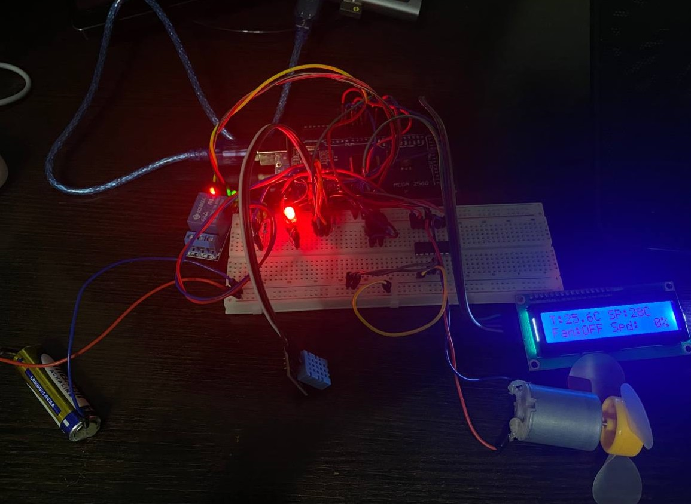

# Lab 5.1 — ON-OFF Temperature Control with Hysteresis (FreeRTOS)

## Objective
Implement an **ON-OFF automatic temperature control system with hysteresis**
(Variant A) on an Arduino Mega 2560 running FreeRTOS.  A DHT22 sensor measures
ambient temperature; when it rises above the upper threshold the system activates
a DC motor (fan) via the L293D H-bridge to cool down.  When temperature drops
below the lower threshold, the motor is stopped.  The hysteresis band prevents
rapid toggling around the set point.

**Additional feature:** two-speed fan zones — 50 % speed for mild overheating,
100 % speed when temperature exceeds the threshold by more than 3 °C.

---

## Requirements

### Hardware Required
- **Microcontroller**: Arduino Mega 2560
- **DHT11 temperature & humidity sensor**: digital, single-wire data
- **L293D motor driver IC**: dual H-bridge, mounted on breadboard
- **3 V DC motor** (or equivalent small motor from LAFVIN kit)
- **Green LED**: cooling ON indicator
- **Red LED**: cooling OFF indicator
- **Passive buzzer**: command feedback beep
- **2× Resistors 220 Ω**: LED current limiting
- **1× Resistor 10 kΩ**: DHT pull-up (some modules have built-in)
- **LCD 16×2 I2C**: status display (address 0x27, 5 V, SDA/SCL)
- **Breadboard**
- **Jumper wires**: male-to-male
- **USB cable**: Type-B (Arduino to PC)

### Software Required
- Visual Studio Code + PlatformIO extension
- Framework: Arduino
- Libraries: `feilipu/FreeRTOS@^11.1.0-3`, `adafruit/DHT sensor library@^1.4.6`
- Build flag: `-DUSE_FREERTOS` (guards Scheduler Timer2 ISR)

---

## Pin Connections

| Component            | Arduino Pin | Notes                                    |
|----------------------|-------------|------------------------------------------|
| DHT11 data           | 2           | Digital, 10 kΩ pull-up to 5 V            |
| Green LED            | 4           | Cooling ON indicator, 220 Ω to GND       |
| Red LED              | 5           | Cooling OFF indicator, 220 Ω to GND      |
| L293D Enable 1       | 6 (PWM)     | Motor speed (analogWrite 0–255)          |
| L293D Input 1        | 7           | Direction bit A                          |
| Passive buzzer       | 8           | Positive leg to pin, negative to GND     |
| L293D Input 2        | 9           | Direction bit B                          |
| LCD SDA              | 20 (SDA)    | I2C data                                 |
| LCD SCL              | 21 (SCL)    | I2C clock                                |
| L293D pin 16 (Vs)    | 5 V         | Motor supply voltage                     |
| L293D pin 8 (Vss)    | 5 V         | Logic supply voltage                     |
| L293D GND (4,5,12,13)| GND         | All four ground pins tied to GND         |
| DHT VCC              | 5 V         | Power                                    |
| DHT GND              | GND         | Ground                                   |
| LCD VCC              | 5 V         | Power                                    |
| LCD GND              | GND         | Ground                                   |

---

## Physical Setup

### Step 0: Power Rails (do this FIRST)

1. Jumper: Arduino **GND** → any hole on **top `−` rail**
2. Jumper: Arduino **5V** → any hole on **top `+` rail**

```
Arduino 5V  ──────→  [+ rail: ─────────────────────────────────────]
Arduino GND ──────→  [- rail: ─────────────────────────────────────]
```

---

### DHT11 Sensor (Arduino pin 2)

Place the DHT11 module on the breadboard at **columns 15, 16, 17**.

```
      col:   15   16   17
row a:      [VCC] [DAT] [GND]   ← DHT11 pins
row b:       |     |      |
row c:       |     |      |
row d:       |     |      |
row e:       |    [J]     └──────→ − rail (GND)
             |     └─────────────→ Arduino pin 2
             └───────────────────→ + rail (5 V)
```

Steps:
1. DHT **VCC** (col 15) → jumper from **col 15, row e** to **`+` rail** (5 V)
2. DHT **DATA** (col 16) → jumper from **col 16, row e** to Arduino **pin 2**
3. DHT **GND** (col 17) → jumper from **col 17, row e** to **`−` rail** (GND)
4. (Optional) 10 kΩ resistor from **col 16** to **`+` rail** (pull-up)

---

### Green LED (Arduino pin 4)

```
      col:   1   2   3   4   5
row a:               [+]  [-]
row b:               [J]   |
row c:                    [=]
row d:                    [=]
row e:                    [G]──────────→ top − rail
```

Steps:
1. LED long leg (anode) → **col 3, row a**
2. LED short leg (cathode) → **col 4, row a**
3. Resistor 220 Ω leg 1 → **col 4, row b**
4. Resistor 220 Ω leg 2 → **col 4, row e**
5. Jumper: Arduino **pin 4** → **col 3, row b**
6. Jumper: **col 4, row e** → **`−` rail**

Circuit: `Pin 4 → col 3 → LED → col 4 → 220 Ω → GND`

---

### Red LED (Arduino pin 5)

```
      col:   8   9   10  11  12
row a:               [+]  [-]
row b:               [J]   |
row c:                    [=]
row d:                    [=]
row e:                    [G]──────────→ top − rail
```

Steps:
1. LED long leg (anode) → **col 10, row a**
2. LED short leg (cathode) → **col 11, row a**
3. Resistor 220 Ω leg 1 → **col 11, row b**
4. Resistor 220 Ω leg 2 → **col 11, row e**
5. Jumper: Arduino **pin 5** → **col 10, row b**
6. Jumper: **col 11, row e** → **`−` rail**

Circuit: `Pin 5 → col 10 → LED → col 11 → 220 Ω → GND`

---

### Passive Buzzer (Arduino pin 8)

```
      col:   26  27  28
row a:       [+]  ·  [-]     ← buzzer legs
row b:       [J]       |
row c:                 └──────→ − rail
```

Steps:
1. Buzzer `+` leg → **col 26, row a**
2. Buzzer `−` leg → **col 28, row a**; jumper from **col 28, row e** → **`−` rail**
3. Jumper: Arduino **pin 8** → **col 26, row e**

Circuit: `Pin 8 → buzzer → GND`

---

### L293D Motor Driver

Place the L293D across the **center gap** of the breadboard.  Notch faces
**left** (pin 1 = col 35, row e).

**Breadboard placement** (columns 35–42):

```
          col:  35   36   37   38   39   40   41   42
               EN1  IN1  OUT1 GND  GND  OUT2 IN2  Vss
               (1)  (2)  (3)  (4)  (5)  (6)  (7)  (8)
        row e:  ●    ●    ●    ●    ●    ●    ●    ●
               ══════════════════════════════════════════  ← center gap
        row f:  ●    ●    ●    ●    ●    ●    ●    ●
               (16) (15) (14) (13) (12) (11) (10)  (9)
               Vs   IN4  OUT4 GND  GND  OUT3 IN3  EN2
```

Steps:
1. Place L293D across the center gap, notch facing left (pin 1 = col 35, row e)
2. **col 35, row a** → jumper to Arduino **pin 6** (EN1 — PWM speed)
3. **col 36, row a** → jumper to Arduino **pin 7** (IN1 — direction A)
4. **col 41, row a** → jumper to Arduino **pin 9** (IN2 — direction B)
5. **col 42, row a** → jumper to **`+` rail** (Vss — 5 V logic supply)
6. **col 35, row j** → jumper to **`+` rail** (Vs — 5 V motor supply)
7. **col 38, row a** + **col 39, row a** → jumper to **`−` rail** (GND pins 4, 5)
8. **col 38, row j** + **col 39, row j** → jumper to **`−` rail** (GND pins 12, 13)
9. **col 37, row a** (OUT1) → motor terminal 1
10. **col 40, row a** (OUT2) → motor terminal 2

Circuit: `Arduino pin 6 (PWM) → EN1`, `pin 7 → IN1`, `pin 9 → IN2` → L293D
drives motor via OUT1/OUT2

---

### LCD 16×2 I2C

| LCD pin | Arduino Mega |
|---------|--------------|
| VCC     | 5 V          |
| GND     | GND          |
| SDA     | pin 20       |
| SCL     | pin 21       |

---

### Complete Wiring Summary

```
Arduino Mega 2560
┌───────────────────┐
│  5V  ─────────────┼──→  + rail ──→ DHT VCC, L293D Vs/Vss, LCD VCC
│  GND ─────────────┼──→  − rail ──→ DHT GND, L293D GND×4, LCD GND
│                   │
│  pin 2  ──────────┼──→  DHT11 DATA (10 kΩ pull-up to 5 V)
│  pin 4  ──────────┼──→  Green LED anode  → cathode → 220 Ω → − rail
│  pin 5  ──────────┼──→  Red   LED anode  → cathode → 220 Ω → − rail
│  pin 6  ──────────┼──→  L293D EN1 (PWM speed)
│  pin 7  ──────────┼──→  L293D IN1 (direction A)
│  pin 8  ──────────┼──→  Buzzer + leg     → − leg   → − rail
│  pin 9  ──────────┼──→  L293D IN2 (direction B)
│  pin 20 (SDA) ────┼──→  LCD SDA
│  pin 21 (SCL) ────┼──→  LCD SCL
│                   │
│  L293D OUT1/OUT2 ─┼──→  Motor terminals (fan)
└───────────────────┘
```

LED current:

$$I_{LED} = \frac{V_{CC} - V_{LED}}{R} = \frac{5\text{ V} - 2\text{ V}}{220\text{ Ω}} \approx 13.6\text{ mA}$$

### Final Setup


---

## Software Architecture

### FreeRTOS 3-Task Pipeline

```
DHT11 ──→ [ T1: Acquisition + Parser ] ──queue──→ [ T2: ON-OFF Controller ] ──mutex──→ [ T3: Display ]
              50 ms poll (prio 2)        CmdMsg     100 ms (prio 3)           report     500 ms (prio 1)
              reads sensor                          hysteresis logic
              parses serial cmds                    drives motor + LEDs
```

### Task 1 — Sensor Acquisition + Command Parser (Priority 2, 50 ms)
- Calls `dhtRead()` each cycle (internally rate-limited to 1 s by the driver)
- Updates `SensorReport` (temperature, humidity, validity) under mutex
- Non-blocking serial character accumulation via `serialLineReady()`
- Parses `set`, `hyst`, `status` commands and sends `CmdMsg` to queue

### Task 2 — ON-OFF Controller with Hysteresis (Priority 3, 100 ms)
- Drains `s_cmdQueue` for setpoint/hysteresis changes
- Reads current temperature from `SensorReport` under mutex
- **ON-OFF hysteresis logic:**
  - `temp ≥ V_on  (setpoint + hysteresis)` → motor ON
  - `temp ≤ V_off (setpoint − hysteresis)` → motor OFF
  - Between V_off and V_on → keep current state
- **Speed zones** (additional feature):
  - `temp ≥ V_on + 3 °C` → 100 % speed (aggressive cooling)
  - `temp ≥ V_on` → 50 % speed (gentle cooling)
- Drives green/red LED indicators
- Buzzer beep on setpoint/hysteresis changes
- Writes `ControlReport` struct under mutex

### Task 3 — Display + Serial Plotter (Priority 1, 500 ms)
- Reads `SensorReport` and `ControlReport` under mutex
- **LCD page 0**: `T:NN.NC SP:NNC` / `Fan:ON  Spd:NNN%`
- **LCD page 1**: `On>NNC Off<NNC` / `Hum:NN.N%`
- Pages alternate every 500 ms
- Serial output in plotter-compatible format:
  `SetPoint:N Temp:N.N V_on:N V_off:N Fan:0|1 Speed:N`

### ON-OFF Hysteresis Control

```
Temperature rising:
    ───────────── V_on (setpoint + hyst) ──→ Motor ON
                      ↑
          Hysteresis band — keep state
                      ↓
    ───────────── V_off (setpoint − hyst) ──→ Motor OFF
Temperature falling:

Example: setpoint = 28°C, hysteresis = 1.5°C
    V_on  = 29.5°C  →  fan starts
    V_off = 26.5°C  →  fan stops
    Between 26.5–29.5°C  →  no change
```

### Speed Zones (Additional Feature)

```
   temp (°C)
       │
       ▼
  temp ≥ V_on + 3°C  ──→  100 % speed (aggressive)
  temp ≥ V_on        ──→   50 % speed (gentle)
  temp ≤ V_off       ──→    0 % (motor OFF)
  else               ──→  keep current speed
```

---

## Reused Library Modules

| Module              | Source     | Role                                     |
|---------------------|------------|------------------------------------------|
| `lib/DhtSensor/`    | Lab 3.2    | DHT11 driver with 1 s rate limiting      |
| `lib/MotorDriver/`  | Lab 4.2    | L293D PWM motor control                  |
| `lib/Lcd/`          | Lab 2.1    | I2C LCD with STDIO redirect              |
| `lib/Led/`          | Lab 1.1    | GPIO LED class                           |
| `lib/Buzzer/`       | Lab 4.1    | Passive buzzer beep                      |

No new library modules were created for Lab 5.1.

---

## Serial Commands

| Command           | Action                                          |
|-------------------|-------------------------------------------------|
| `set N`           | Set target temperature to N °C                  |
| `hyst N`          | Set hysteresis band to ±N °C                    |
| `status`          | Print current setpoint, hysteresis, V_on, V_off |

> Commands are case-insensitive.  Default values: setpoint = 28 °C,
> hysteresis = ±1.5 °C.

---

## Wokwi Simulation

Since Wokwi does not natively simulate the L293D IC, three LEDs substitute for
the motor driver outputs:

| LED colour | Pin | Represents          |
|------------|-----|---------------------|
| Blue       | 6   | Motor PWM (EN1)     |
| White      | 7   | IN1 — forward bit   |
| White      | 9   | IN2 — reverse bit   |

The blue LED brightness reflects the PWM duty cycle (fan speed).
The DHT11 sensor in Wokwi has an interactive temperature slider for testing
hysteresis behavior.

---

## How to Run

1. Set `ACTIVE_LAB` to `9` in `src/main.cpp`
2. Build and upload: `pio run -e mega -t upload`
3. Open Serial Monitor at **9600 baud**
4. Type commands and press Enter:
   - `set 30` — change target temperature to 30 °C
   - `hyst 2` — change hysteresis band to ±2 °C
   - `status` — view current parameters
5. Observe the LCD alternating between temperature/fan and hysteresis/humidity pages
6. Use **Serial Plotter** to visualize SetPoint, Temperature, V_on, V_off, and Fan state in real time
