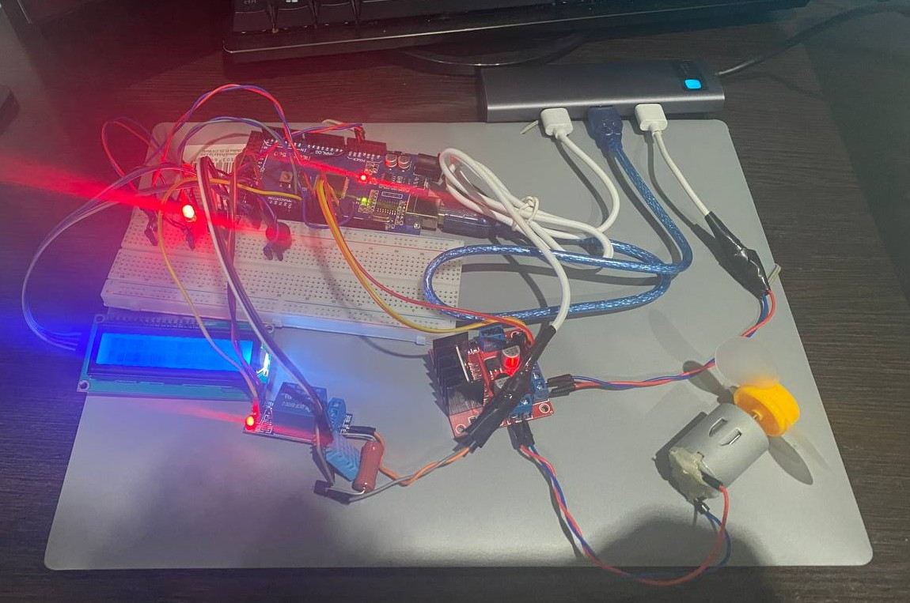

# Lab 5.2 — PID Temperature Control with FreeRTOS

## Objective
Implement a **PID (Proportional-Integral-Derivative) closed-loop temperature controller**
on an Arduino Mega 2560 running FreeRTOS.  A DHT11 digital sensor measures temperature;
a relay drives a resistive heater; an L298N H-bridge drives a DC fan (PWM speed).
The PID output continuously adjusts fan speed or heater state to track a configurable
setpoint.  Real-time data streams to the serial port in Teleplot format.

**Variant A** — digital temperature sensor (DHT11), heater actuated via relay.

> **Note**: The hardware setup is identical to Lab 5.1.  No physical changes are needed
> when switching between the two labs.

---

## Requirements

### Hardware Required
- **Microcontroller**: Arduino Mega 2560
- **DHT11 temperature & humidity sensor**: digital, single-wire data
- **L298N motor driver module**: dual H-bridge, screw-terminal outputs
- **DC motor** (fan, from LAFVIN kit)
- **Single-channel relay module**: 5 V coil, active-LOW IN pin
- **Resistor heater**: any power resistor (e.g. 10–100 Ω, ≥ 0.5 W) controlled via relay
- **External power supply**: 9–12 V for L298N motor supply
- **Green LED**: fan ON indicator
- **Red LED**: heater ON indicator
- **Passive buzzer**: command feedback beep
- **2× Resistors 220 Ω**: LED current limiting
- **1× Resistor 10 kΩ**: DHT pull-up (some modules have built-in)
- **LCD 16×2 I2C**: status display (address 0x27, 5 V, SDA/SCL)
- **Breadboard**
- **Jumper wires**: male-to-male
- **USB cable**: Type-B (Arduino to PC)

### Software Required
- Visual Studio Code + PlatformIO extension
- Framework: Arduino
- Libraries: `feilipu/FreeRTOS@^11.1.0-3`, `adafruit/DHT sensor library@^1.4.6`
- Set `#define ACTIVE_LAB 10` in `src/main.cpp`

---

## Pin Connections

| Component            | Arduino Pin | Notes                                          |
|----------------------|-------------|------------------------------------------------|
| DHT11 data           | 2           | Digital, 10 kΩ pull-up to 5 V                  |
| Relay IN             | 3           | Active-LOW signal from Arduino                 |
| Green LED            | 4           | Fan ON indicator, 220 Ω to GND                 |
| Red LED              | 5           | Heater ON indicator, 220 Ω to GND              |
| L298N ENA            | 6 (PWM)     | Fan speed 0–100 % — ENA jumper removed         |
| L298N IN1            | 7           | Direction bit A                                |
| L298N IN2            | 9           | Direction bit B                                |
| Passive buzzer       | 11 (PWM)    | Positive leg to pin, negative to GND (Timer1A) |
| LCD SDA              | 20 (SDA)    | I2C data                                       |
| LCD SCL              | 21 (SCL)    | I2C clock                                      |
| L298N VCC (logic)    | 5 V         | Logic supply (module internal regulator)       |
| L298N GND            | GND         | Common ground                                  |
| L298N 12 V           | Ext. supply | Motor supply 9–12 V                            |
| Relay VCC            | 5 V         | Relay module power                             |
| Relay GND            | GND         | Ground                                         |
| DHT VCC              | 5 V         | Power                                          |
| DHT GND              | GND         | Ground                                         |
| LCD VCC              | 5 V         | Power                                          |
| LCD GND              | GND         | Ground                                         |

---

## Physical Setup

### Step 0: Power Rails (do this FIRST)

1. Jumper: Arduino **GND** → any hole on **top `−` rail**
2. Jumper: Arduino **5V** → any hole on **top `+` rail**

```
Arduino 5V  ──────→  [+ rail: ─────────────────────────────────────]
Arduino GND ──────→  [- rail: ─────────────────────────────────────]
```

---

### DHT11 Sensor (Arduino pin 2)

Place the DHT11 module on the breadboard at **columns 15, 16, 17**.

```
      col:   15   16   17
row a:      [VCC] [DAT] [GND]   ← DHT11 pins
row b:       |     |      |
row c:       |     |      |
row d:       |     |      |
row e:       |    [J]     └──────→ − rail (GND)
             |     └─────────────→ Arduino pin 2
             └───────────────────→ + rail (5 V)
```

Steps:
1. DHT **VCC** (col 15) → jumper from **col 15, row e** to **`+` rail** (5 V)
2. DHT **DATA** (col 16) → jumper from **col 16, row e** to Arduino **pin 2**
3. DHT **GND** (col 17) → jumper from **col 17, row e** to **`−` rail** (GND)
4. (Optional) 10 kΩ resistor from **col 16** to **`+` rail** (pull-up)

---

### Green LED (Arduino pin 4)

```
      col:   1   2   3   4   5
row a:               [+]  [-]
row b:               [J]   |
row c:                    [=]
row d:                    [=]
row e:                    [G]──────────→ top − rail
```

Steps:
1. LED long leg (anode) → **col 3, row a**
2. LED short leg (cathode) → **col 4, row a**
3. Resistor 220 Ω leg 1 → **col 4, row b**
4. Resistor 220 Ω leg 2 → **col 4, row e**
5. Jumper: Arduino **pin 4** → **col 3, row b**
6. Jumper: **col 4, row e** → **`−` rail**

Circuit: `Pin 4 → col 3 → LED → col 4 → 220 Ω → GND`

---

### Red LED (Arduino pin 5)

```
      col:   8   9   10  11  12
row a:               [+]  [-]
row b:               [J]   |
row c:                    [=]
row d:                    [=]
row e:                    [G]──────────→ top − rail
```

Steps:
1. LED long leg (anode) → **col 10, row a**
2. LED short leg (cathode) → **col 11, row a**
3. Resistor 220 Ω leg 1 → **col 11, row b**
4. Resistor 220 Ω leg 2 → **col 11, row e**
5. Jumper: Arduino **pin 5** → **col 10, row b**
6. Jumper: **col 11, row e** → **`−` rail**

Circuit: `Pin 5 → col 10 → LED → col 11 → 220 Ω → GND`

---

### Passive Buzzer (Arduino pin 11)

```
      col:   26  27  28
row a:       [+]  ·  [-]     ← buzzer legs
row b:       [J]       |
row c:                 └──────→ − rail
```

Steps:
1. Buzzer `+` leg → **col 26, row a**
2. Buzzer `−` leg → **col 28, row a**; jumper from **col 28, row e** → **`−` rail**
3. Jumper: Arduino **pin 11** → **col 26, row e**

Circuit: `Pin 11 → buzzer → GND`

> **Note:** Pin 11 uses Timer1A, avoiding the Timer4 conflict with the motor PWM on pin 6 (OC4A).

---

### L298N Motor Driver Module

The L298N is a ready-made module with screw terminals — no breadboard IC placement needed.

| L298N module pin | Connects to               |
|------------------|---------------------------|
| ENA              | Arduino **pin 6** (PWM)   |
| IN1              | Arduino **pin 7**         |
| IN2              | Arduino **pin 9**         |
| OUT1 / OUT2      | Motor terminals           |
| 12 V             | External supply (+)       |
| GND              | Common GND                |
| 5 V (optional)   | Arduino 5 V (if no jumper)|

> **Important:** Remove the ENA jumper from the module before wiring pin 6, otherwise the motor runs at full speed regardless of PWM.

Steps:
1. Remove the **ENA jumper** from the L298N module
2. Jumper: Arduino **pin 6** → L298N **ENA**
3. Jumper: Arduino **pin 7** → L298N **IN1**
4. Jumper: Arduino **pin 9** → L298N **IN2**
5. Screw terminal: motor wires to **OUT1** and **OUT2**
6. Connect external supply **+** → L298N **12 V**
7. Connect external supply **−** → L298N **GND** (and Arduino GND — common ground)

---

### Relay Module + Resistor Heater (Arduino pin 3)

The relay module breaks the heater circuit when the fan is running.

| Relay module pin | Connects to               |
|------------------|---------------------------|
| VCC              | Arduino **5 V**           |
| GND              | Arduino **GND**           |
| IN               | Arduino **pin 3**         |
| COM              | External supply **+**     |
| NO               | Resistor leg 1            |
| (Resistor leg 2) | Common **GND**            |

Heater circuit (relay ON = resistor powered):
```
Ext supply (+) → Relay COM → Relay NO → [Resistor] → GND
```

Steps:
1. Jumper: Arduino **5 V** → relay module **VCC**
2. Jumper: Arduino **GND** → relay module **GND**
3. Jumper: Arduino **pin 3** → relay module **IN**
4. Wire: external supply **(+)** → relay **COM**
5. Wire: relay **NO** → one leg of the resistor heater
6. Wire: other resistor leg → common **GND**

> Place the resistor heater physically close to the DHT11 sensor so the sensor detects the heat.

---

### LCD 16×2 I2C

| LCD pin | Arduino Mega |
|---------|--------------|
| VCC     | 5 V          |
| GND     | GND          |
| SDA     | pin 20       |
| SCL     | pin 21       |

---

### Complete Wiring Summary

```
Arduino Mega 2560
┌───────────────────┐
│  5V  ─────────────┼──→  + rail ──→ DHT VCC, Relay VCC, LCD VCC
│  GND ─────────────┼──→  − rail ──→ DHT GND, Relay GND, LCD GND, L298N GND, Heater GND
│                   │
│  pin 2  ──────────┼──→  DHT11 DATA (10 kΩ pull-up to 5 V)
│  pin 3  ──────────┼──→  Relay IN  (active-LOW)
│  pin 4  ──────────┼──→  Green LED anode  → cathode → 220 Ω → − rail
│  pin 5  ──────────┼──→  Red   LED anode  → cathode → 220 Ω → − rail
│  pin 6  ──────────┼──→  L298N ENA (PWM speed) — ENA jumper removed
│  pin 7  ──────────┼──→  L298N IN1 (direction A)
│  pin 9  ──────────┼──→  L298N IN2 (direction B)
│  pin 11 ──────────┼──→  Buzzer + leg     → − leg   → − rail  (Timer1A)
│  pin 20 (SDA) ────┼──→  LCD SDA
│  pin 21 (SCL) ────┼──→  LCD SCL
│                   │
│  L298N OUT1/OUT2 ─┼──→  Motor terminals (fan)
│                   │
│  Relay COM ←──────┼──  Ext supply (+)
│  Relay NO  ───────┼──→  Resistor heater → GND
└───────────────────┘

External supply: (+) → L298N 12V and Relay COM
                 (−) → common GND (Arduino GND, L298N GND)
```

LED current:

$$I_{LED} = \frac{V_{CC} - V_{LED}}{R} = \frac{5\text{ V} - 2\text{ V}}{220\text{ Ω}} \approx 13.6\text{ mA}$$

### Final Setup


---

## Software Architecture

### FreeRTOS 3-Task Pipeline

```
DHT11 ──→ [ T1: Acquisition + Parser ] ──queue──→ [ T2: PID Controller ] ──mutex──→ [ T3: Display ]
              50 ms poll (prio 2)        CmdMsg     100 ms (prio 3)         report     500 ms (prio 1)
              reads sensor                          PID computation
              parses serial cmds                    drives motor + relay + LEDs
```

### Task 1 — Sensor Acquisition + Command Parser (Priority 2, 50 ms)
- Calls `dhtRead()` each cycle (internally rate-limited to 1 s by the driver)
- Updates `SensorReport` (temperature, humidity, validity) under mutex
- Non-blocking serial character accumulation via `serialLineReady()`
- Parses `set`, `kp`, `ki`, `kd`, `reset`, `status` commands and sends `CmdMsg` to queue

### Task 2 — PID Controller (Priority 3, 100 ms)
- Drains `s_cmdQueue` for setpoint and gain changes
- Reads current temperature from `SensorReport` under mutex
- **PID algorithm (dt = 0.1 s):**
  - `error = setpoint − temperature`
  - `integral += error × dt` (anti-windup clamp ±200)
  - `derivative = (error − prevError) / dt`
  - `output = clamp(Kp×error + Ki×integral + Kd×derivative, ±100)`
- **Output → actuator mapping:**
  - `output > 0` → Relay ON (heater), motor stopped, Red LED ON
  - `output < 0` → Relay OFF, motor at |output|% speed, Green LED ON
  - `output = 0` → both OFF
- Buzzer beep on setpoint/gain changes
- Writes `ControlReport` struct under mutex

### Task 3 — Display + Serial Plotter (Priority 1, 500 ms)
- Reads `SensorReport` and `ControlReport` under mutex
- **LCD page 0**: `T:NN.NC SP:NNC` / `Fan:ON  Htr:OFF` (or `Fan:OFF Htr:ON`)
- **LCD page 1**: `Kp:N Ki:N` / `Kd:N Out:N%`
- Pages alternate every 500 ms
- Serial output in Teleplot-compatible format:
  `>Temp:N.N,SetPoint:N,Error:N,Output:N,Fan:0|1,Heater:0|1`

### PID Control Law

```
error      = setpoint − temperature
integral  += error × dt              (with anti-windup clamp ±200)
derivative = (error − prevError) / dt
output     = Kp×error + Ki×integral + Kd×derivative   (clamped ±100)

output > 0  →  Relay ON  (heater), fan OFF
output < 0  →  Fan at |output|%,   relay OFF
output = 0  →  both OFF

Example: setpoint = 30°C, Kp = 10, Ki = 0.1, Kd = 5
    temp = 27°C  →  error = +3  →  output ≈ +30  →  heater ON
    temp = 33°C  →  error = -3  →  output ≈ -30  →  fan at 30%
    temp = 30°C  →  error =  0  →  output =   0  →  both OFF
```

---

## Reused Library Modules

| Module              | Source     | Role                                        |
|---------------------|------------|---------------------------------------------|
| `lib/DhtSensor/`    | Lab 3.2    | DHT11 driver with 1 s rate limiting         |
| `lib/MotorDriver/`  | Lab 4.2    | L298N PWM motor control                     |
| `lib/Relay/`        | Lab 4.1    | Single-channel relay, active-LOW            |
| `lib/Lcd/`          | Lab 2.1    | I2C LCD with STDIO redirect                 |
| `lib/Led/`          | Lab 1.1    | GPIO LED class                              |
| `lib/Buzzer/`       | Lab 4.1    | Passive buzzer beep (pin 11, Timer1A)       |

---

## Serial Commands

| Command      | Example      | Effect                                      |
|--------------|--------------|---------------------------------------------|
| `set <C>`    | `set 28`     | Change setpoint; resets integral & prevError |
| `kp <value>` | `kp 15`      | Set proportional gain                        |
| `ki <value>` | `ki 1`       | Set integral gain                            |
| `kd <value>` | `kd 3`       | Set derivative gain                          |
| `reset`      | `reset`      | Zero integral accumulator and prevError      |
| `status`     | `status`     | Print SP, Kp, Ki, Kd to serial               |

> Commands are case-insensitive.  Default values: setpoint = 30 °C, Kp = 10.0, Ki = 0.1, Kd = 5.0.

---

## LED Indicators

| LED   | State | Meaning                |
|-------|-------|------------------------|
| Green | ON    | Fan is running         |
| Red   | ON    | Heater relay is active |
| Both  | OFF   | System idle (at setpoint) |

---

## How to Run

1. Set `ACTIVE_LAB` to `10` in `src/main.cpp`
2. Build and upload: `pio run -e mega -t upload`
3. Open Serial Monitor at **9600 baud**
4. Type commands and press Enter:
   - `set 30` — change target temperature to 30 °C
   - `kp 15` — increase proportional gain
   - `status` — view current parameters
5. Observe the LCD alternating between temperature/heater state and PID gains/output pages
6. Use **Serial Plotter** (Teleplot) to visualize SetPoint, Temperature, Error, and Output in real time
