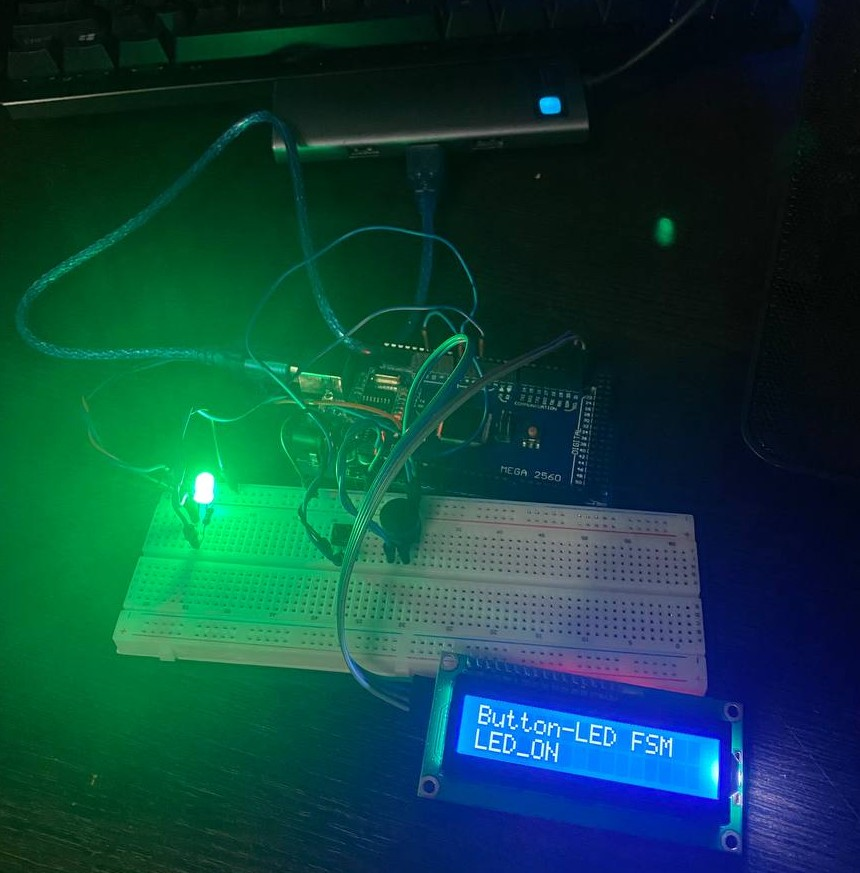

# Lab 6.1 — Behavioural Control with Finite State Machines (Moore) – Button-LED

## Objective
Implement a **Moore Finite State Machine** on an Arduino Mega 2560 running
FreeRTOS that controls an LED based on button presses.  The FSM has two states
(LED_OFF and LED_ON) and transitions between them on every validated button
press.  Software debounce is handled by a dedicated acquisition task calling
the Button library at a fixed 20 ms period.  The current FSM state is reported
in real time via the Serial interface.

The FSM engine (`lib/MooreFsm/`) is a generic reusable module — the lab
application only supplies the state table; the evaluation logic is library code.

---

## Requirements

### Hardware Required
- **Microcontroller**: Arduino Mega 2560
- **LED** (any colour, from LAFVIN kit)
- **Tactile push button**: momentary, normally open
- **Resistor 220 Ω**: LED current limiting
- **Breadboard**
- **Jumper wires**: male-to-male
- **USB cable**: Type-B (Arduino to PC)

### Software Required
- Visual Studio Code + PlatformIO extension
- Framework: Arduino
- Libraries: `feilipu/FreeRTOS@^11.1.0-3`
- Build flag: `-DUSE_FREERTOS` (guards Scheduler Timer2 ISR)

---

## Pin Connections

| Component        | Arduino Pin | Notes                                   |
|------------------|-------------|-----------------------------------------|
| LED anode        | 4           | Through 220 Ω to GND                   |
| Button leg 1     | 7           | `INPUT_PULLUP` — other leg to GND       |

---

## Physical Setup

### Step 0: Power Rails (do this FIRST)

1. Jumper: Arduino **GND** → any hole on **top `−` rail**
2. Jumper: Arduino **5V** → any hole on **top `+` rail**

```
Arduino 5V  ──────→  [+ rail: ─────────────────────────────────────]
Arduino GND ──────→  [- rail: ─────────────────────────────────────]
```

---

### LED (Arduino pin 4)

Place the LED at **columns 3–4**.

```
      col:   3    4    5    6    7
row a:       [+]  [-]
row b:       [J]   |
row c:             [=]  220 Ω
row d:             [=]
row e:             [G]──────────→ − rail
```

Steps:
1. LED long leg (anode) → **col 3, row a**
2. LED short leg (cathode) → **col 4, row a**
3. Resistor 220 Ω leg 1 → **col 4, row b**
4. Resistor 220 Ω leg 2 → **col 4, row e**
5. Jumper: Arduino **pin 4** → **col 3, row b**
6. Jumper: **col 4, row e** → **`−` rail**

Circuit: `Pin 4 → LED → 220 Ω → GND`

LED current:

$$I_{LED} = \frac{V_{CC} - V_{LED}}{R} = \frac{5\text{ V} - 2\text{ V}}{220\text{ Ω}} \approx 13.6\text{ mA}$$

---

### Button (Arduino pin 7)

Place the button straddling the breadboard centre gap at **columns 20–21**.

```
      col:   20   21
row d:       [B1] [B2]   ← button legs (same side = same pin)
row e:       [G]   |
              |   row d → col 21 → Arduino pin 7
              └──────→ − rail (GND)
```

Steps:
1. Button leg 1 → **col 20, row d** (tie to GND via `−` rail)
2. Button leg 2 → **col 21, row d** (signal leg)
3. Jumper: **col 20, row e** → **`−` rail** (GND)
4. Jumper: Arduino **pin 7** → **col 21, row d**

> The Button library configures `INPUT_PULLUP` internally — no external resistor
> needed.  Pressing the button pulls pin 7 LOW (active-LOW logic).

---

### Complete Wiring Summary

```
Arduino Mega 2560
┌───────────────────┐
│  GND ─────────────┼──→  − rail ──→ LED cathode (via 220 Ω), Button leg 1
│  5V  ─────────────┼──→  + rail   (optional, for future expansion)
│                   │
│  pin 4 ───────────┼──→  LED anode → cathode → 220 Ω → − rail
│  pin 7 ───────────┼──→  Button signal leg  (other leg → GND)
│                   │
│  USB (Serial)─────┼──→  PC Serial Monitor (9600 baud)
└───────────────────┘
```

### Final Setup


---

## Software Architecture

### Moore FSM

A **Moore automaton** produces output that depends **only on the current state**,
not on the input:

- `NextState = f(Input, CurrentState)`
- `Output    = g(CurrentState)`

The 4-step evaluation cycle (per PDF Listing 7.5):

```
Step 1: Apply output for current state
Step 2: Hold state for its defined period (debounce lockout)
Step 3: Read input (button)
Step 4: Transition to next state
```

### FSM State Table

| # | State   | Output | Hold | Input = 0 | Input = 1 |
|---|---------|--------|------|-----------|-----------|
| 0 | LED_OFF | 0      | 100 ms | LED_OFF | LED_ON  |
| 1 | LED_ON  | 1      | 100 ms | LED_ON  | LED_OFF |

Input = 0 → no press (keep state); Input = 1 → valid press → toggle.

### State Diagram

```
              press               press
  ┌──────┐  ─────────→  ┌─────────┐
  │LED_OFF│              │ LED_ON  │
  │out=0  │  ←─────────  │ out=1   │
  └───┬───┘  press       └────┬────┘
      │ no press              │ no press
      └──────────────(self)───┘
```

### FreeRTOS 3-Task Architecture

```
Button ──→ [ T1: Acquisition ]  ──semaphore──→ [ T2: Moore FSM ]  ──semaphore──→ [ T3: Display ]
              20 ms (prio 3)       s_btnEvent    event-driven (prio 2)  s_dispSem    500 ms (prio 1)
              buttonUpdate()                     fsmEval() + LED                     Serial print
              buttonWasPressed()
```

### Task 1 — Button Acquisition (Priority 3, 20 ms)
- Calls `buttonUpdate()` every 20 ms to advance the edge-detect debounce state machine
- Gives `s_btnEvent` binary semaphore on every confirmed press-release cycle
- 20 ms polling provides inherent 20 ms hardware debounce

### Task 2 — Moore FSM Evaluation (Priority 2, event-driven)
- Blocks on `s_btnEvent` (portMAX_DELAY)
- On wakeup: holds state for `fsmGetHoldMs()` (100 ms) — drains further button
  events arriving in that window to prevent phantom double-transitions
- Calls `fsmEval(&s_fsm, 1)` to advance the state machine
- Applies LED output via `led->turnOn()` / `led->turnOff()` based on `fsmGetOutput()`
- Gives `s_dispSem` to wake T3 immediately

### Task 3 — Serial Display (Priority 1, event + 500 ms timeout)
- Wakes immediately on `s_dispSem` to print the new state: `[FSM] -> LED_ON`
- Falls through on 500 ms timeout to emit a heartbeat: `[FSM] State: LED_OFF`

---

## Reused Library Modules

| Module             | Source     | Role                                                      |
|--------------------|------------|-----------------------------------------------------------|
| `lib/MooreFsm/`    | Lab 6.1    | Generic Moore FSM engine — struct + eval, reusable        |
| `lib/Button/`      | Lab 2.1    | Edge-detect debounce driver, `INPUT_PULLUP`               |
| `lib/Led/`         | Lab 1.1    | GPIO LED class (`turnOn`, `turnOff`, `toggle`)            |

---

## Serial Output

The Serial Monitor (9600 baud) shows state transitions and a heartbeat:

```
Lab 6.1 — Button-LED Moore FSM
Press button to toggle LED
[FSM] State: LED_OFF
[FSM] -> LED_ON
[FSM] State: LED_ON
[FSM] -> LED_OFF
[FSM] State: LED_OFF
```

- Lines with `->` are emitted immediately on every FSM transition.
- Lines with `State:` are periodic heartbeats every 500 ms when no button is pressed.

---

## How to Run

1. Set `ACTIVE_LAB` to `11` in `src/main.cpp`
2. Build and upload: `pio run -e mega -t upload`
3. Open Serial Monitor at **9600 baud**
4. Press the button — the LED toggles and the new state is printed immediately
5. Observe the heartbeat lines to confirm the FSM is running between presses
